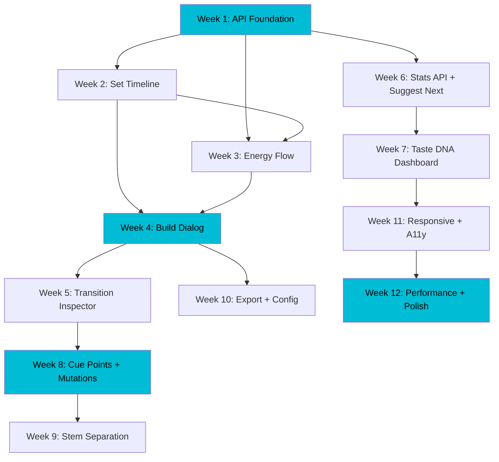

# Kiku — Product Roadmap

**Version:** 1.0
**Date:** 2026-03-14
**Timeframe:** Q2 2026 (April - June)
**Author:** Solo developer

**Vision:** Build the first DJ set planning tool that teaches you WHY transitions work, not just which ones do — combining 5-dimension beam search optimization with energy flow mentorship in a web interface no competitor offers.

---

## Current State Summary

### Architecture

```mermaid
graph LR
    subgraph Frontend["Frontend (30% complete)"]
        LB[Library Browser]
        WP[Waveform Player]
        ST["Set Timeline ❌"]
        TD["Taste DNA ❌"]
    end

    subgraph API["FastAPI (16 endpoints)"]
        TR[/tracks]
        SE[/sets]
        WF[/waveforms]
        AU[/audio]
        EX[/export]
        SA[/stats]
    end

    subgraph Engine["Core Engine (100% complete)"]
        BS[Beam Search]
        SC[5-Dim Scoring]
        CW[Camelot Wheel]
        EP[Energy Profiles]
        GF[Genre Families]
    end

    subgraph Data["Data Layer"]
        DB[(SQLite\n4119 tracks\n5 tables)]
    end

    Frontend -->|REST| API
    API --> Data
    Engine --> Data
```

### Key Metrics

| Metric | Value |
|--------|-------|
| Tracks in library | 4,119 (4,066 with audio features) |
| DB tables | 5 (tracks, audio_features, sets, set_tracks, transition_cues) |
| CLI commands | 13 (all working) |
| API endpoints | 16 (read-heavy, missing mutations) |
| Frontend components | 7 (library browsing + waveform playback) |
| Saved sets | 3 |
| Genres covered | ~30 across 7 families |
| Energy levels | 9 |
| Scoring dimensions | 5 (harmonic, energy, BPM, genre, quality) |

### What Works Today

- **CLI:** Full set building pipeline — search, build, suggest-next, export, analyze, autotag
- **Backend:** Track search, audio streaming (with Range support), waveform serving (base64 Float32), set CRUD (read), cue CRUD, library stats, Rekordbox export
- **Frontend:** Library browser with 7-filter search, track table with Camelot-colored keys, wavesurfer.js waveform playback with pre-computed peaks, audio features display
- **Analysis:** Essentia + Librosa pipeline, ML energy autotagger, MFCC similarity, 4-band frequency separation

### What's Missing

- **No way to build a set from the web UI** — the core feature
- **No suggest-next or transition scoring API** — prepared schemas exist but no endpoints
- **No drag-and-drop** — no set arrangement UX at all
- **No energy flow visualization** — chart.js installed but unused
- **No pagination** — 50-track hard limit on search
- **No SSE/streaming** — long-running jobs (set building) would freeze the UI

---

## Month 1: Foundation — Set Building Core

**Theme:** Make the core product loop work end-to-end in the browser.
**Deliverable:** User can build a set, see it as a timeline with transition scores and energy curve, reorder tracks via drag-and-drop.

### Week 1: API Foundation

Build the missing mutation endpoints that the frontend needs.

| Task | Endpoint | Wraps | File |
|------|----------|-------|------|
| Set build (SSE) | `POST /api/sets/build` | `build_set()` from `src/djsetbuilder/setbuilder/planner.py`. Returns SSE stream (Server-Sent Events) with progress updates — with 4,119 tracks, beam search can take time and will timeout on a synchronous endpoint | `src/djsetbuilder/api/routes/sets.py` |
| Suggest next | `GET /api/tracks/{id}/suggest-next` | `score_transitions()` from `src/djsetbuilder/setbuilder/scoring.py` | `src/djsetbuilder/api/routes/tracks.py` |
| Create empty set | `POST /api/sets` | Direct ORM insert | `src/djsetbuilder/api/routes/sets.py` |
| Delete set | `DELETE /api/sets/{id}` | Direct ORM delete (cascade) | `src/djsetbuilder/api/routes/sets.py` |
| Rename set | `PUT /api/sets/{id}` | Direct ORM update | `src/djsetbuilder/api/routes/sets.py` |
| Add pagination | `offset` param on `GET /api/tracks/search` | Existing query + `.offset()` | `src/djsetbuilder/api/routes/tracks.py` |

**Request schema for `POST /api/sets/build`:**
```
{
  "name": "Friday Night Techno",
  "duration_min": 60,
  "energy_preset": "journey",     // warmup|peak-time|journey|afterhours|custom
  "genre_filter": ["techno"],
  "bpm_min": 128,
  "bpm_max": 138,
  "seed_track_id": null,
  "beam_width": 5,
  "playlist_preference": null
}
```

**Testing:** Write pytest tests alongside each new endpoint. At minimum: verify each endpoint returns correct status codes and response shapes. This prevents 12 weeks of untested accumulation. Tests live in `tests/api/`.

**Pydantic models to add** in `src/djsetbuilder/api/schemas.py`:
- `SetBuildRequest` — input for build endpoint
- `SuggestNextResponse` — list of scored candidates
- `SetCreateRequest` — name + optional energy profile
- `SetUpdateRequest` — name
- `SetTrackReorderRequest` — ordered list of track IDs

### Week 2: Set Timeline Component

Build the core set viewing and arrangement UI.

> **Note:** `frontend/src/lib/components/set/` already contains scaffolded components: `SetTimeline.svelte`, `SetView.svelte`, `SetPicker.svelte`, `ScoreBreakdown.svelte`, and `TransitionDetail.svelte`. Week 2 should build on these existing components rather than creating from scratch — refactor and extend them to match the specifications below.

| Component | File | Purpose |
|-----------|------|---------|
| `SetTimeline.svelte` | `frontend/src/lib/components/set/SetTimeline.svelte` | Main timeline container (extend existing) |
| `SetTrackCard.svelte` | `frontend/src/lib/components/set/SetTrackCard.svelte` | Individual track in timeline |
| `TransitionIndicator.svelte` | `frontend/src/lib/components/set/TransitionIndicator.svelte` | Score bar between tracks |
| `SetSelector.svelte` | `frontend/src/lib/components/set/SetSelector.svelte` | Load/create/delete sets |

**Install dependency:**
```bash
cd frontend && npm install svelte-dnd-action
```

**SetTimeline behavior:**
1. Drag-and-drop reorder via `svelte-dnd-action` (`onconsider`/`onfinalize`)
2. On reorder: recalculate transition scores for affected pairs, update energy curve
3. Between each track pair: `TransitionIndicator` showing color bar (green >0.8, yellow 0.5-0.8, red <0.5) with hover tooltip breaking down all 5 scoring dimensions
4. Track cards show: title, artist, key (Camelot-colored), BPM, energy level, transition score to next

**API client additions** in `frontend/src/lib/api/sets.ts`:
- `buildSet(params)` — POST to `/api/sets/build`
- `createSet(name)` — POST to `/api/sets`
- `deleteSet(id)` — DELETE to `/api/sets/{id}`
- `updateSet(id, name)` — PUT to `/api/sets/{id}`
- `getTransition(setId, index)` — GET to `/api/sets/{id}/transition/{index}`

**State management** — activate the unused `frontend/src/lib/stores/ui.svelte.ts` store for `selectedSetId` and `activeTab` cross-component state.

### Week 3: Energy Flow Curve

Visualize the energy journey using chart.js (already installed at v4.5.1).

| Component | File | Purpose |
|-----------|------|---------|
| `EnergyFlowChart.svelte` | `frontend/src/lib/components/set/EnergyFlowChart.svelte` | Chart.js line chart |

**Chart specification:**
- X-axis: track position (1, 2, 3...) or cumulative time
- Y-axis: energy level (0.0 - 1.0, mapped from 9 discrete levels)
- **Target curve:** Dashed line — the energy profile (warmup -> build -> peak -> cooldown) via linear interpolation from `EnergyProfile` segments
- **Actual curve:** Solid line with gradient fill — green where within 0.15 of target, yellow at 0.15-0.3, red beyond 0.3
- Click a point to scroll timeline to that track
- Tooltip: track name, energy, BPM, key, transition score

**Integration:** Embedded above the `SetTimeline` track list. Updates in real-time during drag-and-drop reordering.

### Week 4: Set Build Dialog + Integration

| Component | File | Purpose |
|-----------|------|---------|
| `BuildSetDialog.svelte` | `frontend/src/lib/components/set/BuildSetDialog.svelte` | Build configuration form |
| `EnergyPresetPicker.svelte` | `frontend/src/lib/components/set/EnergyPresetPicker.svelte` | Visual preset selector |

**Build dialog fields:**
- Set name (text)
- Duration (slider, 30-180 min)
- Energy preset (visual cards: warmup, peak-time, journey, afterhours)
- Genre filter (multi-select from 7 families + sub-genres)
- BPM range (dual slider)
- Seed track (optional, search field)
- Beam width (advanced, default 5)

**End-to-end flow:**
1. User clicks "Build Set" in Set Timeline tab
2. Fills dialog, submits
3. `POST /api/sets/build` fires
4. Loading state with progress indicator
5. Set loads into timeline with transition scores + energy curve
6. User reorders via drag-and-drop, scores update live

### Month 1 Success Criteria

- [ ] Can build a set from the web UI with energy preset and genre filter
- [ ] Set displays as draggable timeline with transition quality indicators
- [ ] Energy flow chart shows actual vs. target curve
- [ ] Reordering updates transition scores and energy curve in real-time
- [ ] Can create, rename, delete sets
- [ ] Track search supports pagination (offset parameter)
- [ ] Suggest-next API returns scored candidates for a given track

---

## Month 2: Intelligence — Transitions & Library Insights

**Theme:** Understand WHY transitions work. See your library's DNA.
**Deliverable:** Dual-waveform transition inspector, library stats dashboard, Taste DNA visualization, suggest-next in the UI.

### Week 5: Transition Inspector

The signature teaching feature — no competitor explains transitions.

| Component | File | Purpose |
|-----------|------|---------|
| `TransitionInspector.svelte` | `frontend/src/lib/components/transition/TransitionInspector.svelte` | Dual-waveform transition view |
| `ScoreBreakdown.svelte` | `frontend/src/lib/components/transition/ScoreBreakdown.svelte` | 5-dimension score visualization |
| `CamelotMini.svelte` | `frontend/src/lib/components/transition/CamelotMini.svelte` | Key relationship display |

**TransitionInspector behavior:**
1. Click a `TransitionIndicator` in the set timeline to open
2. Two synchronized wavesurfer.js instances (outgoing track + incoming track)
3. Waveforms aligned at transition point
4. Score breakdown panel showing all 5 dimensions with bar charts
5. Mentorship tooltip explaining the key relationship ("Adjacent keys on the Camelot wheel — this transition will feel natural and seamless")

**WaveSurfer plugin additions** to `frontend/src/lib/components/waveform/WavesurferPlayer.svelte`:
- **Timeline plugin:** Beat grid overlay using stored `beat_positions` data from `/api/waveforms/{id}/detail`
- **Hover plugin:** Timestamp display on hover

### Week 6: Crossfade Preview + Suggest Next + Library Stats API

**Crossfade preview** — add audio crossfade to the Transition Inspector built in Week 5:
- Crossfade preview via Web Audio GainNodes:
  ```
  AudioContext
    ├── MediaElementSource(A) → GainNode(A) ─┐
    └── MediaElementSource(B) → GainNode(B) ─┼── Destination
  ```
- Regions plugin integration for cue-in/cue-out markers on both waveforms, connected to existing `TransitionCue` model and cue CRUD API

| Task | Endpoint/Component | Details |
|------|-------------------|---------|
| Enhanced stats API | `GET /api/stats/enhanced` | Wraps `enhanced_stats()` from `src/djsetbuilder/analysis/insights.py` |
| BPM histogram API | `GET /api/stats/bpm-histogram` | Wraps `bpm_histogram()` |
| Energy-genre heatmap API | `GET /api/stats/energy-genre` | Wraps `energy_genre_heatmap()` |
| Camelot distribution API | `GET /api/stats/camelot` | Wraps `camelot_distribution()` |
| Library gaps API | `GET /api/stats/gaps` | Wraps `library_gaps()` |
| Suggest-next UI | `SuggestNextPanel.svelte` | Shows scored candidates when a track is selected in the set timeline |

**SuggestNextPanel:** When the user selects a track in the timeline and clicks "Suggest Next", show a ranked list of candidates with transition score breakdowns. Clicking a candidate inserts it after the selected track.

### Week 7: Library Stats Dashboard

Activate the "Taste DNA" tab in `frontend/src/lib/components/Workspace.svelte`.

| Component | File | Purpose |
|-----------|------|---------|
| `TasteDNA.svelte` | `frontend/src/lib/components/stats/TasteDNA.svelte` | Dashboard container |
| `GenreDistribution.svelte` | `frontend/src/lib/components/stats/GenreDistribution.svelte` | Donut chart of genre families |
| `BpmHistogram.svelte` | `frontend/src/lib/components/stats/BpmHistogram.svelte` | BPM distribution |
| `CamelotWheel.svelte` | `frontend/src/lib/components/stats/CamelotWheel.svelte` | Key coverage on Camelot wheel |
| `EnergyGenreHeatmap.svelte` | `frontend/src/lib/components/stats/EnergyGenreHeatmap.svelte` | Energy x Genre matrix |
| `LibraryGaps.svelte` | `frontend/src/lib/components/stats/LibraryGaps.svelte` | Weakness report |

**Taste DNA visualization concept:**
- Radar chart showing the DJ's signature across 6 axes: energy range, BPM range, harmonic diversity, genre breadth, curation depth, library coverage
- Each axis normalized 0-1 based on library analysis
- This is the "fingerprint" that makes this tool feel personal

**Mentorship integration:** Each stat panel includes a one-line teaching note. Example: "Your library clusters at 130-135 BPM — tracks at 126-128 would let you build longer warm-ups."

### Week 8: Cue Point Management + Set Track Mutations

| Task | Details |
|------|---------|
| Cue point UI | Visual markers on waveforms (Regions plugin). Click to create, drag to adjust, right-click to delete. Uses existing `createCue()` and `deleteCue()` API functions in `frontend/src/lib/api/sets.ts` |
| Set track mutations API | `POST /api/sets/{id}/tracks` (add track), `DELETE /api/sets/{id}/tracks/{position}` (remove track), `PUT /api/sets/{id}/tracks` (reorder) in `src/djsetbuilder/api/routes/sets.py` |
| Add track to set | Drag from library browser into set timeline (cross-panel drop zone) |
| Remove track from set | Delete button on `SetTrackCard`, or drag out of timeline |

### Month 2 Success Criteria

- [ ] Transition inspector shows dual waveforms with cue points and crossfade preview
- [ ] Score breakdown explains all 5 dimensions with teaching tooltips
- [ ] Taste DNA dashboard shows genre, BPM, key, energy distributions
- [ ] Library gaps identified and displayed with actionable suggestions
- [ ] Suggest-next works from the set timeline
- [ ] Can add/remove/reorder tracks in a set manually
- [ ] Cue points visible on waveforms, creatable/deletable

---

## Month 3: Expression — Remix Learning & Polish

**Theme:** From planning sets to understanding music. Ship a polished v1.
**Deliverable:** Stem separation integration, Rekordbox export from UI, responsive design, performance optimization.

### Week 9: Stem Separation Integration

Server-side stem separation using Demucs (open-source, highest quality in benchmarks).

| Task | Details |
|------|---------|
| Demucs integration | New module `src/djsetbuilder/analysis/stems.py` — wraps `demucs` CLI or Python API for 4-stem separation (vocals, drums, bass, other) |
| Stems API | `POST /api/tracks/{id}/stems` (trigger separation), `GET /api/tracks/{id}/stems` (check status/list stems), `GET /api/audio/{id}/stem/{stem}` (stream individual stem) |
| Stems UI | `StemPlayer.svelte` — 4-track stem visualization with per-stem mute/solo/volume, using 4 wavesurfer.js instances |
| Storage | Stems saved to `data/stems/{track_id}/` as separate audio files |

**Mentorship angle:** "Listen to just the drums — notice how the kick pattern drives the energy. Now listen to the bass — hear how it anchors the groove." The stem player becomes a teaching tool for understanding track anatomy.

**Dependency:** `pip install demucs` (already uses PyTorch, runs on CPU or GPU)

### Week 10: Export & Config

| Task | Details |
|------|---------|
| Rekordbox export UI | Export button on set detail. Uses existing `POST /api/sets/{id}/export/rekordbox` endpoint. Download as XML file. Wire to `frontend/src/lib/api/` (currently no client function) |
| Config API | `GET /api/config` and `PUT /api/config` in new `src/djsetbuilder/api/routes/config.py`. Exposes scoring weights and energy presets |
| Scoring weights UI | `ScoringConfig.svelte` — 5 sliders for dimension weights (harmonic, energy, BPM, genre, quality), normalized to sum to 1.0 |
| Energy preset editor | `EnergyPresetEditor.svelte` — visual editor for custom energy profiles. Add/remove segments, drag target energy levels, name the preset |

### Week 11: Responsive Design & Accessibility

| Task | Details |
|------|---------|
| Responsive layout | Replace fixed `--panel-width: 500px` in `frontend/src/app.css` with collapsible sidebar. Breakpoints at 768px (stack panels), 1024px (side-by-side) |
| Mobile touch | Verify `svelte-dnd-action` touch handling on set timeline |
| Keyboard navigation | Add `aria-label`, `role`, `tabindex` to track table, set timeline, waveform controls. Tab through tracks, Enter to select, Space to play |
| Loading states | Replace "Loading..." text with skeleton components matching final layout |
| Error boundaries | Wrap each panel in error boundary with retry button |

### Week 12: Performance & Polish

| Task | Details |
|------|---------|
| Virtual scrolling | Add virtual list to `TrackTable.svelte` for large search results (4000+ tracks). Use `svelte-virtual-list` or custom intersection observer |
| Waveform caching | Cache decoded waveform data in memory to avoid re-fetching on tab switches. Use a Map keyed by track ID |
| SSE for long jobs | Already implemented from Week 1. Verify SSE reconnection handling and add progress events for stem separation (Week 9) if applicable |
| Batch API | `POST /api/tracks/batch` for fetching multiple tracks in one request (needed when loading a set) |
| Production build | Verify `adapter-static` output, configure CORS for production origin, test full build pipeline |

### Month 3 Success Criteria

- [ ] Stem separation works for at least one track (Demucs integration)
- [ ] Stem player lets you mute/solo individual stems
- [ ] Rekordbox export accessible from the UI
- [ ] Scoring weights adjustable from the UI
- [ ] Custom energy presets creatable and saveable
- [ ] Responsive layout works on tablet (768px+)
- [ ] Keyboard navigation through core workflows
- [ ] Track table handles 4000+ tracks without jank
- [ ] Set building SSE progress (implemented Week 1) verified stable under load

---

## Dependencies & Technical Debt

### Dependency Graph



### Technical Debt to Address

| Debt | Priority | When | Details |
|------|----------|------|---------|
| Alembic migration consolidation | P1 | Week 1 | Replace `_migrate_schema()` ALTER TABLE hacks in `src/djsetbuilder/db/models.py` with proper Alembic migrations. Generate migration from current ORM models, drop the inline migration code |
| Dead frontend code | P2 | Week 2 | `frontend/src/lib/stores/ui.svelte.ts` is unused. Either activate it (recommended — use for `selectedSetId`, `activeTab`) or remove it |
| Track search effect loop | P2 | Week 2 | `$effect(() => { store.search({}); })` in `LibraryBrowser.svelte` re-runs on every render. Guard with `onMount` or use `$effect.root` |
| API pagination | P1 | Week 1 | 50-track hard limit on `/api/tracks/search`. Add `offset` parameter |
| Missing API client functions | P2 | Week 2 | No frontend client for `/api/sets/{id}/waveforms`, `/api/sets/{id}/transition/{idx}`, export endpoint |
| Cue update endpoint | P2 | Week 8 | Currently must delete + recreate. Add `PUT /api/sets/cues/{id}` |
| SSE/WebSocket for builds | P1 | Week 1 | `POST /api/sets/build` uses SSE from day one — designed as streaming endpoint to avoid timeouts on 4,119-track library |
| Testing | P2 | Ongoing | Zero test coverage. Add Vitest for frontend components, pytest for API endpoints. Focus on scoring logic and API contracts |

### New Dependencies

| Package | When | Purpose | Size |
|---------|------|---------|------|
| `svelte-dnd-action` | Week 2 | Drag-and-drop set reordering | ~15KB |
| `demucs` | Week 9 | Stem separation (server-side) | ~200MB with PyTorch |
| `chartjs-plugin-annotation` | Week 3 | Segment labels on energy chart | ~20KB |

All other capabilities (wavesurfer.js, chart.js, SvelteKit, FastAPI) are already installed.

---

## Success Metrics

### Month 1: "I can build a set"

| Metric | Target |
|--------|--------|
| Set build from browser | Working end-to-end |
| Drag-and-drop reorder | < 100ms score recalculation |
| Energy curve rendering | Updates on every reorder |
| New API endpoints | 6+ (build, suggest-next, CRUD) |
| New frontend components | 6+ (timeline, cards, chart, dialog) |

### Month 2: "I understand my transitions"

| Metric | Target |
|--------|--------|
| Transition inspector | Dual waveform + crossfade preview |
| Teaching tooltips | All 5 scoring dimensions explained |
| Taste DNA dashboard | 6+ visualization panels |
| Cue point management | Create/delete on waveforms |
| Suggest-next in UI | Ranked list with scores |

### Month 3: "I can learn and export"

| Metric | Target |
|--------|--------|
| Stem separation | 4-stem split working |
| Rekordbox XML export | One-click from UI |
| Responsive layout | Usable at 768px+ |
| Track table performance | 4000+ tracks, no scroll jank |
| Keyboard accessibility | Core workflows navigable |

### Overall v1.0 Definition of Done

A DJ can:
1. Open the web UI and browse their 4,119-track library with filters
2. Build an optimized set choosing energy preset, genre, and BPM range
3. View the set as a timeline with color-coded transition quality indicators
4. See the energy flow curve and understand where it diverges from the target
5. Click a transition to inspect dual waveforms and hear the crossfade
6. Read teaching notes explaining WHY the harmonic relationship works
7. Drag tracks to reorder, with scores updating live
8. Add tracks from the library via suggest-next recommendations
9. View their Taste DNA (genre, BPM, key, energy distributions)
10. Export the set as Rekordbox XML for the club

---

## Risk Register

| Risk | Likelihood | Impact | Mitigation |
|------|-----------|--------|------------|
| **Scope creep** — solo dev, 12 weeks, ambitious scope | High | High | Each month ships a functional increment. Cut stems (Week 9) before cutting set building (Weeks 1-4). Stem separation is a "nice to have"; set building is the product |
| **Demucs performance** — CPU stem separation is slow (~2-5 min per track) | Medium | Medium | Run async with SSE progress. Cache stems. GPU acceleration if available. Can defer to Month 3 stretch goal |
| **Crossfade preview complexity** — synchronizing two Web Audio sources with gain automation | Medium | Medium | Start with simple volume crossfade (linear gain ramp). Add EQ crossfade later. Two wavesurfer instances sharing one AudioContext is a proven pattern |
| **svelte-dnd-action + Svelte 5** — potential compatibility issues | Low | High | Library confirms Svelte 5 support via `onconsider`/`onfinalize`. Prototype in Week 2 Day 1, pivot to native HTML5 DnD if broken |
| **SQLite concurrency** — set builds + API reads on same DB | Low | Medium | Single-user tool. Use WAL mode (`PRAGMA journal_mode=WAL`). If contention appears, queue builds |
| **Energy autotagger accuracy** — ML predictions may not match user expectations | Medium | Low | Energy Tinder UI (spec 002) lets users approve/reject predictions. Teaching opportunity: "The algorithm classified this as 'Peak' because of the high spectral energy and fast BPM — do you agree?" |
| **Large waveform data transfer** — 4000+ tracks with waveform blobs | Medium | Medium | Already using pre-computed base64 peaks. Add browser-side LRU cache. Virtual scrolling prevents loading all at once |

### If Behind Schedule

**Drop order (least to most critical):**
1. Stem separation (Week 9) — defer to v1.1
2. Custom energy preset editor (Week 10) — keep presets, skip editor
3. Responsive design (Week 11) — desktop-only for v1.0
4. SVG energy overlay upgrade — keep chart.js version
5. Library gaps panel — keep basic stats, skip gap analysis

**Never drop:**
- Set building from browser (Weeks 1-4) — this IS the product
- Transition quality indicators — the core UX differentiator
- Energy flow chart — the teaching tool no competitor has

---

## File Reference

Key files for implementation:

| Purpose | Path |
|---------|------|
| CLI entry point | `src/djsetbuilder/cli.py` |
| Beam search planner | `src/djsetbuilder/setbuilder/planner.py` |
| 5-dimension scoring | `src/djsetbuilder/setbuilder/scoring.py` |
| Camelot wheel | `src/djsetbuilder/setbuilder/camelot.py` |
| Energy profiles | `src/djsetbuilder/setbuilder/constraints.py` |
| DB models (5 tables) | `src/djsetbuilder/db/models.py` |
| DB queries | `src/djsetbuilder/db/store.py` |
| Library insights | `src/djsetbuilder/analysis/insights.py` |
| Energy autotagger | `src/djsetbuilder/analysis/autotag.py` |
| FastAPI app | `src/djsetbuilder/api/main.py` |
| API models (14 Pydantic models) | `src/djsetbuilder/api/schemas.py` |
| API routes (6 modules) | `src/djsetbuilder/api/routes/` |
| Frontend app shell | `frontend/src/routes/+layout.svelte` |
| Workspace (tabs) | `frontend/src/lib/components/Workspace.svelte` |
| Waveform player | `frontend/src/lib/components/waveform/WavesurferPlayer.svelte` |
| Track view | `frontend/src/lib/components/waveform/TrackView.svelte` |
| API client base | `frontend/src/lib/api/client.ts` |
| Sets API client | `frontend/src/lib/api/sets.ts` |
| UI store (unused) | `frontend/src/lib/stores/ui.svelte.ts` |
| TypeScript types | `frontend/src/lib/types/index.ts` |
| Camelot utils | `frontend/src/lib/utils/camelot.ts` |
| Global styles | `frontend/src/app.css` |
