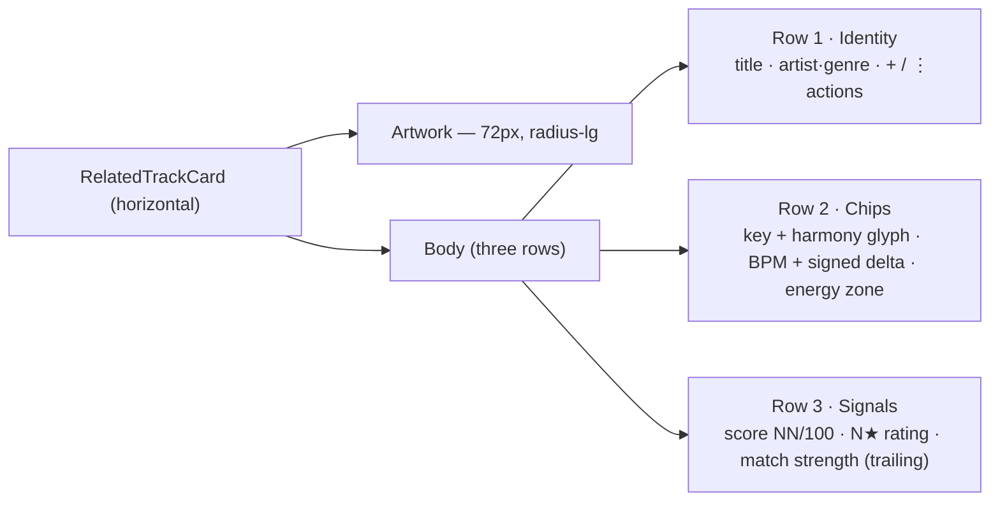

# Related Track Card — Guidelines

The **Related track card** (`library/RelatedTrackCard.svelte`) is the taller,
**horizontal** card the DJ reads under the **Related tracks** header on the track
view. Each card is a candidate to mix into next — it answers *"what mixes well
from here, and why?"* — and it is **comparative by construction**: every signal on
it (harmony move, BPM delta, match score, affinity strength) is measured against
the reference track the DJ is looking at.

| | |
|---|---|
| **Component** | `library/RelatedTrackCard.svelte` |
| **Lives in** | the **Related tracks** grid — `waveform/SimilarTracks.svelte` — on the track view |
| **Grid density** | **4-up × 2 rows** (8 visible; each card ≈230px wide) |

> **Why a new card, not the old compact tier.** The Related grid used to run 6-up,
> which crushed the comparative card into its dense compact-pill tier: 38px
> artwork, no room to breathe. This card is the redesign — fewer per row, a
> **prominent artwork**, and honest padding, laid out **4-up across two rows** (8
> candidates before "Show more") so the grid reads as a tidy block rather than one
> crushed row. It reuses the shared shell's *vocabulary*
> (`capFirst` / `scoreStrength` from `TrackCard.svelte`, the same `Chip`,
> `StarRating`, `HarmonyIcon`, `Menu` primitives and camelot utils) but lays it out
> horizontally rather than as a vertical three-tier stack.

This doc covers what is **specific** to this card. For everything shared —
capitalization, overflow, number formatting, color-as-meaning, states,
iconography, motion, terminology, composition — see
[`content-conventions.md`](./content-conventions.md). Those rules apply here
without restatement. The shared comparative *shell* and the Standalone mode are
documented in [`track-card.md`](./track-card.md).

---

## When to use

- **Reach for it** in the track view's Related tracks grid, where each track is
  weighed *against* the reference track and the comparison *is* the point.
- Because it is comparative-only, it always needs a **reference** —
  `parentTrackId`, and ideally `parentBpm` + `parentKey` so the harmony move and
  BPM delta can render. Without a reference track, use the Standalone card
  (`track-card.md`), which structurally cannot show a score it can't justify.
- **Never** hand-roll a related row. This card owns the comparative anatomy,
  capitalization and tokens; a bespoke row drifts.

---

## Anatomy

A horizontal split: a prominent artwork column, then a body of three stacked rows.

- **Artwork** — 72px square, `--radius-lg`, `--surface-1` fallback with a
  disc-and-note glyph when the image fails. The roomy left column the redesign is
  about.
- **Row 1 · Identity** — first-letter-capped title (`capFirst`, full value on hover
  per §2); artist · genre subtitle, the genre as **genre-family-colored text** (no
  box) and the artist as muted plain text that **ellipsizes first** (§2, §4). The
  `+` (add to set) and `⋮` (options) actions sit at the trailing edge.
- **Row 2 · Chips** — priority order key → BPM → energy. The key chip carries its
  **harmony-move glyph** and harmony-derived color; the BPM chip carries its
  metronome glyph + a **signed delta colored green / orange / red by magnitude**
  (seamless ≤6% / moderate ≤12% / tension, §3, §4) — the color is always paired
  with the number, never the only cue.
- **Row 3 · Signals** — the match **score `NN/100`** (lead), the DJ's **rating** as
  a compact `N★`, and **affinity** as a labelled qualitative **strength bar**
  (Great / Likely / Weak / Not for me) pushed to the trailing edge — never a second
  raw number (§3), never color alone (§4). The fuller phrasing is on hover.

---

## Responsive tiers

The grid drives density; the card fills its equal-height cell and only relaxes if
it lands narrow.

| Grid width | Layout | Card behavior |
|-----------|--------|---------------|
| **4-up** (≈230px, default) | full artwork + three-row body | compact-artwork tier (see below) |
| **3-up** (`@container ≤ 880px`) | same | full card |
| **2-up** (`@container ≤ 640px`) | same | roomier still; unchanged |
| **1-up** (`@container ≤ 440px`) | one card per row | full width |
| **< 260px** (card container query) | same | relaxed padding + artwork shrinks to 52px — graceful, no restructuring |

The grid steps 4-up → 3-up → 2-up → 1-up in `waveform/SimilarTracks.svelte`, with
`VISIBLE_COUNT = 8` so the default 4-up width reads as **two rows of four**. At
that width each card lands ≈230px — inside the card's own
`@container relcard (max-width: 260px)` tier, which relaxes the padding and shrinks
the artwork to 52px so the card stays legible without restructuring.

---

## States

| State | Behavior |
|-------|----------|
| **Default** | Resting card; `--surface-2`, `--border-subtle`. |
| **Hover** | `border-color: var(--border-strong)`; transition via `--dur-fast` / `--ease-standard`. |
| **Focus-visible** | Keyboard ring from the global `--focus-ring` rule (card is `role="button"`, `tabindex="0"`). |
| **Dragging** | `draggable` — sets `application/x-kiku-track` payload for drop into a set. |
| **Menu open** | `⋮` / right-click opens the `Menu` primitive (opinion rows + play / open). |
| **Add picker open** | `+` toggles the `AddToSetPicker` popover (`--surface-1`, `--elev-3`). |
| **Affinity: good / bad** | Match word reads **Great** / **Not for me**; a `bad` opinion animates the card out of the grid (handled by `SimilarTracks.svelte`). |

---

## Tokens used

Consumes the semantic layer (`frontend/src/lib/styles/tokens.semantic.css`)
exclusively. The **only** non-token literals are the artwork box sizes (72px / 52px)
and the one `260px` container-query threshold — intentional layout constants,
matching the shared card's convention.

| Category | Tokens |
|----------|--------|
| Surfaces | `--surface-1`, `--surface-2`, `--surface-3` |
| Text | `--text-1`, `--text-2`, `--text-3`, `--text-4` |
| Borders | `--border-subtle`, `--border-strong` |
| Meaning color | `--score-excellent`, `--score-good`, `--score-poor`, `--zone-*`, `--chip-genre-fg`, `--accent`, `--destructive` |
| Spacing | `--space-px`, `--space-2xs`, `--space-xs`, `--space-sm`, `--space-md`, `--space-lg`, `--space-4xl` |
| Radius | `--radius-lg` (artwork), `--radius-sm` (buttons), `--radius-xs` (bars), `--radius-xl` (card) |
| Type | `--text-xs`, `--text-sm`, `--text-lg`, `--font-weight-medium`, `--font-weight-semibold`, `--lh-sm` |
| Icon | `--icon-size-sm` |
| Motion | `--dur-fast`, `--ease-standard` |
| Elevation | `--elev-3` (add-to-set popover) |

---

## Open items

- The card recomputes the harmony move / BPM delta locally (via the shared camelot
  utils + `scoreStrength`), rather than sharing an extracted derivation module with
  `TrackCard.svelte`'s `related` arm. Kept deliberately: the primitives already
  encapsulate the heavy lifting, so the duplication is a few lines of arithmetic —
  extract only if a third comparative surface appears.
- `TrackCard.svelte`'s `related` union arm and its compact-pill tier are retained
  on the shared shell but no longer wired on the track view. Removing the dead arm
  is a separate hygiene task (out of scope for the redesign).
