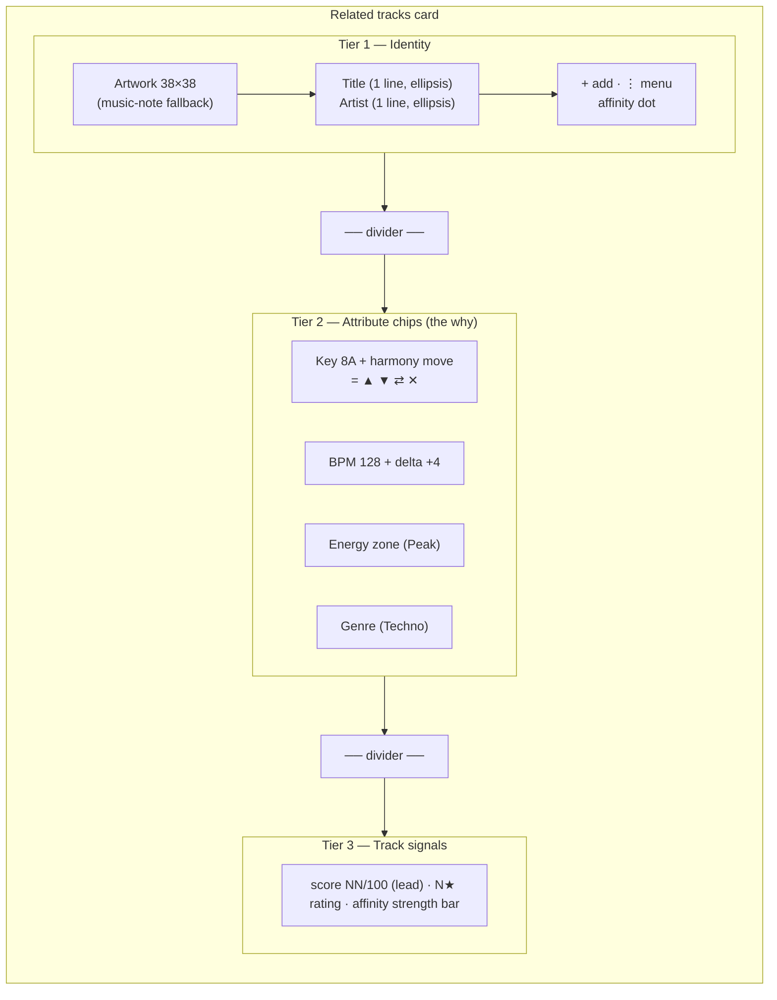

# Related Tracks Card — Guidelines

The Related tracks card (`frontend/src/lib/components/library/SimilarTrackCard.svelte`)
is the densest information surface in Kiku: it answers "what mixes well from
here, and *why*?" in one scannable tile. It renders inside the **Related tracks**
section (`frontend/src/lib/components/waveform/SimilarTracks.svelte`) on the track
view.

This doc covers what is **specific** to this card. For everything shared —
capitalization, overflow, number formatting, color-as-meaning, states,
iconography, motion, terminology, composition — see
[`content-conventions.md`](./content-conventions.md). Those rules apply here
without restatement; this doc only notes where the card *applies* or *narrows*
them.

---

## Anatomy

The card stacks three tiers, separated by dividers, reading top-to-bottom from
*what it is* → *why it fits* → *how good + what to do*.

- **Tier 1 — Identity**: artwork → title → artist. Who is this track? Plus the
  per-card actions (`+` add to set, `⋮` `<Menu>`). One line each, first-letter-capped,
  full value on hover.
- **Tier 2 — Attribute chips / the "why"**: the harmonic and energetic reasons it
  fits, as `<Chip>`s in priority order key → BPM → energy → genre — Camelot key +
  harmony-move icon, BPM + signed delta, energy zone, genre. This tier is the card's
  reason to exist; it's "Show the Why" made visible. See [Chips](#chips).
- **Tier 3 — Track signals**: the quality verdict (match score), the DJ's own
  rating (compact `N★`), and affinity-as-strength — see
  **[Track signals block](#track-signals-block)**.

---

## Title & artist

- **One line each**, ellipsis on overflow, **no wrap**. (This replaced the old
  2-line `-webkit-line-clamp: 2` on the title.)
- Full value exposed on hover/focus via `title` (per
  [content-conventions §2](./content-conventions.md#2-overflow--wrapping)).
- Title and artist are **first-letter-capped** via the shared `capFirst()` helper —
  the first visible character is forced to a capital, the rest of the string is left
  intact (so `deadmau5` → `Deadmau5` but `MEDUZA` stays `MEDUZA`). This is a USER
  DECISION (spec 023) that overrides the previous "preserve source casing" default;
  the underlying library value is never mutated and the full original is still on
  hover (per [content-conventions §1](./content-conventions.md#1-capitalization)).

---

## Chips

Tier 2 renders a row of chips in a fixed **priority order**:

1. **Key** (Camelot + harmony move) — the harmonic relationship is the strongest
   "why."
2. **BPM** (+ signed delta) — tempo compatibility.
3. **Energy** (zone) — where it sits in the journey.
4. **Genre** — coarsest signal, lowest priority.

All four are the shared `<Chip>` primitive (`variant="key|bpm|energy|genre"`) —
no bespoke pills. The key chip carries a `<HarmonyIcon>` glyph for the move.

**Rules**
- The chip row is **no-wrap** (`flex-wrap: nowrap; overflow: hidden`) — chips do
  not flow to a second line (that would break card height; see §2).
- When space-constrained, the row clips from the end, so the **lowest-priority
  chips (genre, then energy) are the first to go**, preserving key + BPM.
- Chip colors come from **semantic tokens by meaning** (the `--zone-*` set for
  energy, `--score-*` for the harmony band, `--bpm-delta-*` via the chip's `tone`
  for the ±6% tension rule) — never hardcoded pastel hex.
- Each color-coded chip pairs color with text/glyph (zone name, harmony glyph,
  signed delta), per §4.

---

## Track signals block

> **STATUS: LOCKED — built in `SimilarTrackCard.svelte` (spec 023, step 5).**

Tier 3 groups the three "how good is this?" signals into **one readable unit**
named **"Track signals."** Previously the match score and stars sat in Tier 3
while the affinity signal lived as a separate dot up in Tier 1; they are now one
left-to-right cluster so the DJ reads the full verdict — *our score, your rating,
your call* — in a single glance.

**What it consolidates**
- **Match score** — `NN/100`, the tool's compatibility verdict.
- **Rating** — the DJ's own rating as a compact `N★` (`StarRating display="compact"`).
- **Affinity strength** — a labelled qualitative strength, NOT a raw number.

**Layout** (token-based, no literals) — a single horizontal row,
`display: flex; align-items: center; gap: var(--space-md)`, with the same
`--space-sm var(--space-md)` padding as the other tiers:

1. **Score `NN/100` (lead anchor, leftmost, heaviest)** — `NN` at `--text-lg`,
   `--font-weight-semibold`, `--text-1`; suffix `/100` at `--text-xs`, `--text-3`.
   It is the headline verdict, so it carries the most weight.
2. **Rating** — `<StarRating display="compact" size="sm" />` → `N★` when
   `rating > 0` (the DJ's curation signal beside the tool's verdict); when unrated,
   the canonical muted `—` (content-conventions §3), never a blank gap.
3. **Affinity strength (pushed right, `margin-left: auto`)** — a small 3-segment
   **strength bar + word**, mapping the match score onto a qualitative band so the
   row never shows a second raw number competing with `NN/100` (§3) and never
   relies on color alone (§4). When the DJ has set an explicit opinion the word
   becomes that opinion ("Great together" / "Not for me"); otherwise it reads the
   strength label. The full opinion + strength is in the `title` tooltip.

**Affinity-strength thresholds** (`scoreStrength()` in `SimilarTrackCard.svelte`),
derived from the match score (0–1):

| Score | Label | Bars | Color token |
|-------|-------|------|-------------|
| ≥ 0.80 | **Strong match** | ███ (3) | `--score-excellent` |
| ≥ 0.55 | **Likely match** | ██ (2) | `--score-good` |
| < 0.55 | **Weak match** | █ (1) | `--score-poor` |

**Degradation**
- No score → `—` in the score slot (never blank).
- No rating → muted `—` in the rating slot.
- Explicit affinity set → the word shows the opinion; the bar still reflects score.
- Space-constrained → keep score (the headline) and the strength word; the bar and
  rating are the first to compress.

**Why**: grouping the tool's score next to the DJ's own rating and a plain-language
strength read reinforces "Opinions You Can See Through" — the DJ sees *why* and can
argue back, without two numerics fighting for the same glance.

---

## States

Per [content-conventions §5](./content-conventions.md#5-states). Card-specific
behavior:

| State | Behavior |
|-------|----------|
| **Default** | Resting card; `--surface-2`, `--border-subtle`. |
| **Hover** | `border-color: var(--border-strong)`; transition via `--dur-fast`. |
| **Focus-visible** | Keyboard ring from the global `--focus-ring` rule (card is `role="button"`, `tabindex="0"`). |
| **Selected** | `border: var(--space-2xs) solid var(--accent)`. NOTE: `isSelected` is declared but never set true — wire it or drop the rule (see Open items). |
| **No-artwork fallback** | Inline music-note SVG in `--text-4` on `--surface-1`. |
| **Affinity set/unset** | Set → the Tier-3 strength word reads the opinion ("Great together" / "Not for me") with the full opinion + strength in `title`; unset → the strength word reads the score band ("Strong / Likely / Weak match"). |
| **Loading** | Owned by the wrapper: `<Spinner label="Finding what mixes..." />`. |
| **Empty** | Owned by the wrapper: muted "Nothing in your library mixes cleanly from here yet". |

**Keyboard reachability**: the `+` and `⋮` actions live in Tier 1 and must remain
Tab-reachable and show on focus (content-conventions §5) — they are not
hover-only.

---

## Tokens used

The card consumes the semantic layer (`frontend/src/lib/styles/tokens.semantic.css`)
exclusively. No px/hex literals.

| Category | Tokens |
|----------|--------|
| Surfaces | `--surface-1`, `--surface-2`, `--surface-3`, `--surface-hover` |
| Text | `--text-1`, `--text-2`, `--text-3`, `--text-4` |
| Borders | `--border-subtle`, `--border-strong` |
| Accent / status | `--accent` (selected/primary action), `--destructive` (bad affinity), zone/status ramp for energy chips |
| Spacing | `--space-2xs`, `--space-xs`, `--space-sm`, `--space-md`, `--space-lg`, `--space-xl` |
| Type | `--text-2xs` … `--text-lg`, `--lh-*`, `--font-weight-medium/semibold` |
| Radius | `--radius-md` (artwork), `--radius-sm` (buttons), `--radius-full` (chips/dots), `--radius-xl` (card) |
| Motion | `--dur-fast`, `--ease-standard` |
| Elevation | `--elev-3` (add-to-set popover) |

**Outstanding debt**: the hardcoded `PHASE_PILL_COLORS` / delta-badge pastel hex
are **gone** — chips now derive color from the `--zone-*`, `--score-*`, and
`--bpm-delta-*` token sets via `<Chip>`. The remaining non-token literals are the
artwork's `38px` and the popover's `220px min-width`.

---

## Open items

Resolved (spec 023, step 5):

1. ~~**Title casing**~~ — **RESOLVED**: titles/artists are now **first-letter-capped**
   (`capFirst()`), overriding preserve-source. `deadmau5` → `Deadmau5`.
2. ~~**"Track signals" block**~~ — **RESOLVED**: built as the locked
   [Track signals block](#track-signals-block); the Tier-1 affinity dot was removed
   and affinity moved to Tier 3 as a labelled strength.
4. ~~**Chip drop order**~~ — **RESOLVED**: the chip row is `nowrap` + `overflow:
   hidden`, so it clips from the end (genre → energy first), preserving key + BPM.
5. ~~**Zone/status color tokens**~~ — **RESOLVED**: chips consume `--zone-*`,
   `--score-*`, and `--bpm-delta-*` tokens; no hardcoded hex remains on this card.

Still open (needs user confirmation):

3. **Selected state**: `isSelected` is dead (never set true). Wire it to a real
   selection concept or remove the `.selected` rule.
