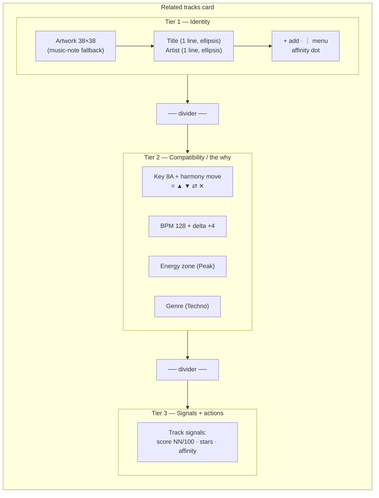

# Related Tracks Card — Guidelines

The Related tracks card (`frontend/src/lib/components/library/SimilarTrackCard.svelte`)
is the densest information surface in Kiku: it answers "what mixes well from
here, and *why*?" in one scannable tile. It renders inside the **Related tracks**
section (`frontend/src/lib/components/waveform/SimilarTracks.svelte`) on the track
view.

This doc covers what is **specific** to this card. For everything shared —
capitalization, overflow, number formatting, color-as-meaning, states,
iconography, motion, terminology, composition — see
[`content-conventions.md`](./content-conventions.md). Those rules apply here
without restatement; this doc only notes where the card *applies* or *narrows*
them.

---

## Anatomy

The card stacks three tiers, separated by dividers, reading top-to-bottom from
*what it is* → *why it fits* → *how good + what to do*.

- **Tier 1 — Identity**: artwork → title → artist. Who is this track? Plus the
  per-card actions (`+` add to set, `⋮` menu) and the affinity dot.
- **Tier 2 — Compatibility / the "why"**: the harmonic and energetic reasons it
  fits — Camelot key + harmony-move icon, BPM + signed delta, energy zone, genre.
  This tier is the card's reason to exist; it's "Show the Why" made visible.
- **Tier 3 — Consolidated signals + actions**: the quality verdict (match score),
  the DJ's own rating (read-only stars), and affinity — see
  **[Consolidated signals block](#consolidated-signals-block)** (PROPOSAL).

---

## Title & artist

- **One line each**, ellipsis on overflow, **no wrap**. (This replaces the old
  2-line `-webkit-line-clamp: 2` on the title — see
  [Open items](#open-items).)
- Full value exposed on hover/focus via `title` (per
  [content-conventions §2](./content-conventions.md#2-overflow--wrapping)).
- Title and artist **preserve source casing** — this is the DJ's library, not our
  copy (per [content-conventions §1](./content-conventions.md#1-capitalization)).

---

## Chips

Tier 2 renders a row of chips in a fixed **priority order**:

1. **Key** (Camelot + harmony move) — the harmonic relationship is the strongest
   "why."
2. **BPM** (+ signed delta) — tempo compatibility.
3. **Energy** (zone) — where it sits in the journey.
4. **Genre** — coarsest signal, lowest priority.

**Rules**
- The chip row is **no-wrap** — chips do not flow to a second line (that would
  break card height; see content-conventions §2).
- When space-constrained, **hide the lowest-priority chip first** (genre, then
  energy). Never shrink-to-illegible; drop in priority order.
- Chip colors come from **semantic tokens by meaning** — never the hardcoded
  pastel hex currently in `PHASE_PILL_COLORS` / the delta badge. Those literals
  are debt to migrate onto the zone/status token set (per content-conventions §4).
- Each color-coded chip pairs color with text/glyph (zone name, harmony glyph),
  per content-conventions §4.

---

## Consolidated signals block

> **STATUS: PROPOSAL — needs user review before implementation.**

Today, Tier 3 shows the match score (`NN / 100`) and read-only stars side by
side, and the affinity signal lives as a separate dot up in Tier 1. Three related
"how good is this?" signals are scattered across two tiers. The proposal merges
them into **one readable unit** named **"Track signals."**

**What it consolidates**
- **Match score** — `NN / 100`, the tool's compatibility verdict.
- **Rating** — the DJ's own read-only stars (curation signal).
- **Affinity** — the DJ's explicit "great together" / "not for me" opinion.

**Proposed layout** (token-based, no literals)
- A single horizontal row at the bottom tier, `display: flex; align-items:
  center; justify-content: space-between;` with `gap: var(--space-md)`.
- **Left — match score (most prominent)**: `NN` at `--text-lg`,
  `--font-weight-medium`, `--text-1`; suffix `/ 100` at `--text-xs`, `--text-3`.
  This is the card's headline verdict, so it carries the most weight.
- **Middle — rating**: read-only `StarRating size="sm"` when `rating > 0`;
  when unrated, render the canonical missing-data treatment (a muted `—`), never
  a blank gap (content-conventions §3).
- **Right — affinity**: a small labelled marker — affinity glyph/dot **plus** a
  text or tooltip cue ("Great together" / "Not for me"), so it never relies on
  color alone (content-conventions §4). Moving affinity here groups all three
  judgments together; the Tier-1 dot is removed to avoid duplication.
- **Spacing/alignment**: vertical baseline alignment across score + stars +
  affinity; `--space-md` between groups; the whole block uses the same
  `--space-sm var(--space-md)` padding as the other tiers for rhythm.

**Degradation**
- No score → show `—` in the score slot (never blank).
- No rating → show `—` (or omit stars and let the score+affinity sit left/right).
- No affinity → omit the affinity marker entirely (it's an explicit opinion; its
  absence is meaningful, so no `—` placeholder needed).
- Space-constrained → keep score (the headline) and affinity; rating degrades to
  a compact form before anything else drops.

**Why**: one grouped "Track signals" unit lets the DJ read the full verdict —
*our score, your rating, your call* — in a single glance, instead of hunting a
dot in Tier 1 and a number in Tier 3. It reinforces "Opinions You Can See
Through" by placing the tool's score next to the DJ's own signals.

---

## States

Per [content-conventions §5](./content-conventions.md#5-states). Card-specific
behavior:

| State | Behavior |
|-------|----------|
| **Default** | Resting card; `--surface-2`, `--border-subtle`. |
| **Hover** | `border-color: var(--border-strong)`; transition via `--dur-fast`. |
| **Focus-visible** | Keyboard ring from the global `--focus-ring` rule (card is `role="button"`, `tabindex="0"`). |
| **Selected** | `border: var(--space-2xs) solid var(--accent)`. NOTE: `isSelected` is currently declared but never set true — wire it or drop the rule (see Open items). |
| **No-artwork fallback** | Inline music-note SVG in `--text-4` on `--surface-1`. |
| **Affinity set/unset** | Set → affinity marker shown (good/bad) with label; unset → no marker. |
| **Loading** | Owned by the wrapper: `<Spinner label="Finding what mixes..." />`. |
| **Empty** | Owned by the wrapper: muted "Nothing in your library mixes cleanly from here yet". |

**Keyboard reachability**: the `+` and `⋮` actions live in Tier 1 and must remain
Tab-reachable and show on focus (content-conventions §5) — they are not
hover-only.

---

## Tokens used

The card consumes the semantic layer (`frontend/src/lib/styles/tokens.semantic.css`)
exclusively. No px/hex literals.

| Category | Tokens |
|----------|--------|
| Surfaces | `--surface-1`, `--surface-2`, `--surface-3`, `--surface-hover` |
| Text | `--text-1`, `--text-2`, `--text-3`, `--text-4` |
| Borders | `--border-subtle`, `--border-strong` |
| Accent / status | `--accent` (selected/primary action), `--destructive` (bad affinity), zone/status ramp for energy chips |
| Spacing | `--space-2xs`, `--space-xs`, `--space-sm`, `--space-md`, `--space-lg`, `--space-xl` |
| Type | `--text-2xs` … `--text-lg`, `--lh-*`, `--font-weight-medium/semibold` |
| Radius | `--radius-md` (artwork), `--radius-sm` (buttons), `--radius-full` (chips/dots), `--radius-xl` (card) |
| Motion | `--dur-fast`, `--ease-standard` |
| Elevation | `--elev-3` (add-to-set popover) |

**Outstanding debt**: the harmony badge's `17px` width/height, the artwork's
`38px`, the popover's `220px min-width`, and the `PHASE_PILL_COLORS` / delta-badge
pastel hex are the remaining non-token literals — migrate to tokens (zone/status
token set for the colors).

---

## Open items

Decisions that need user confirmation:

1. **Title casing**: titles currently preserve source casing (per
   content-conventions §1). Confirm we do **not** force first-letter-cap on
   titles/artists — i.e. `deadmau5` stays `deadmau5`. (Default assumption:
   preserve source.)
2. **"Track signals" block**: approve the consolidated Tier-3 design above,
   including moving the affinity marker out of Tier 1.
3. **Selected state**: `isSelected` is dead (never set true). Wire it to a real
   selection concept or remove the `.selected` rule.
4. **Chip drop order under constraint**: confirm hide-order genre → energy when
   space-limited (vs. shrinking).
5. **Zone/status color tokens**: where the energy-zone and delta colors live as
   tokens (a `--zone-*` set in `tokens.semantic.css` vs. a shared TS map) — needed
   to kill the last hardcoded hex on this card.
