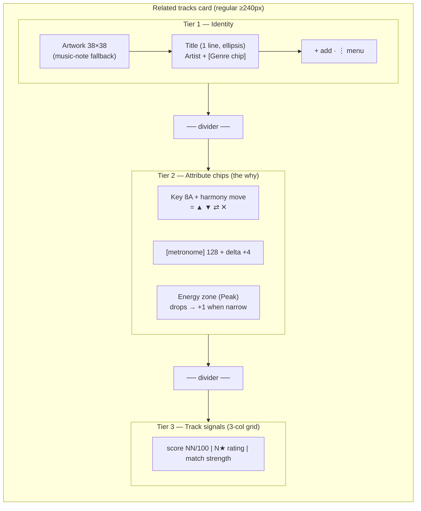

# Related Tracks Card — Guidelines

The Related tracks card (`frontend/src/lib/components/library/SimilarTrackCard.svelte`)
is the densest information surface in Kiku: it answers "what mixes well from
here, and *why*?" in one scannable tile. It renders inside the **Related tracks**
section (`frontend/src/lib/components/waveform/SimilarTracks.svelte`) on the track
view.

This doc covers what is **specific** to this card. For everything shared —
capitalization, overflow, number formatting, color-as-meaning, states,
iconography, motion, terminology, composition — see
[`content-conventions.md`](./content-conventions.md). Those rules apply here
without restatement; this doc only notes where the card *applies* or *narrows*
them.

---

## Anatomy

The card stacks three tiers, separated by dividers, reading top-to-bottom from
*what it is* → *why it fits* → *how good + what to do*. At its **regular** width
all three tiers show; the card **restructures** at narrower container widths (see
[Responsive tiers](#responsive-tiers)).

- **Tier 1 — Identity**: artwork → title → **artist + genre chip** subtitle. Who is this
  track? Plus the per-card actions (`+` add to set, `⋮` `<Menu>`). Title is one line,
  first-letter-capped, full value on hover. **Genre lives here**, not in the chip row:
  it is descriptive identity metadata, not a transition signal, so it belongs with the
  artist on the subtitle line. Genre is rendered as a small **genre `<Chip>`** (not muted
  text) so it reads as clearly as the colored key/energy chips; the artist is plain muted
  text that ellipsizes first under width pressure.
- **Tier 2 — Attribute chips / the "why"**: the harmonic and energetic reasons it
  fits, as `<Chip>`s in priority order key → BPM → energy — Camelot key +
  harmony-move icon, a **metronome glyph + integer BPM + signed delta** (no literal
  "BPM" text), energy zone. This tier is the card's reason to exist; it's "Show the
  Why" made visible. See [Chips](#chips).
- **Tier 3 — Track signals**: the quality verdict (match score), the DJ's own
  rating (compact `N★`), and affinity-as-strength — see
  **[Track signals block](#track-signals-block)**.

---

## Title, artist & genre

- **Title** is one line, ellipsis on overflow, **no wrap**. (This replaced the old
  2-line `-webkit-line-clamp: 2`.)
- **Artist and genre share one identity subtitle line.** The artist is plain muted text;
  **genre is a small `<Chip variant="genre" size="sm">`**, placed after the artist (e.g.
  `Lena Vox  [Techno]`). Genre was moved out of the chip row into the identity tier
  because it is descriptive metadata, not a transition signal — it belongs with *who the
  track is*, beside the artist. The artist takes priority and **ellipsizes first** under
  width pressure (`flex-shrink: 1`); the **genre chip stays fixed and visible**
  (`flex-shrink: 0`) so it reads as clearly as the colored key/energy chips. When genre
  is missing, only the artist shows. The genre chip is **hidden** at the intermediate and
  compact tiers (space too tight — see [Responsive tiers](#responsive-tiers)).
- The genre chip's visibility comes from the `genre` `<Chip>` variant's own tinted
  treatment (a soft accent-tinted surface + accent-strength text + matching border,
  all from `--chip-genre-*` tokens) — a **system-wide** contrast bump so every genre
  chip reads clearly, not just on this card.
- Full value exposed on hover/focus via `title` on the artist span and the genre chip
  (per [content-conventions §2](./content-conventions.md#2-overflow--wrapping)).
- Title and artist are **first-letter-capped** via the shared `capFirst()` helper —
  the first visible character is forced to a capital, the rest of the string is left
  intact (so `deadmau5` → `Deadmau5` but `MEDUZA` stays `MEDUZA`). This is a USER
  DECISION (spec 023) that overrides the previous "preserve source casing" default;
  the underlying library value is never mutated and the full original is still on
  hover (per [content-conventions §1](./content-conventions.md#1-capitalization)).

---

## Chips

Tier 2 renders a row of chips in a fixed **priority order**:

1. **Key** (Camelot + harmony move) — the harmonic relationship is the strongest
   "why." Transition-critical; always shown.
2. **BPM** (metronome + integer + signed delta) — tempo compatibility.
   Transition-critical; always shown.
3. **Energy** (zone) — where it sits in the journey. Lowest priority; **drops first**
   when the card is narrow.

Genre is **no longer a Tier-2 chip** — it moved to the identity tier as a genre chip
(see [Title, artist & genre](#title-artist--genre)).

All are the shared `<Chip>` primitive (`variant="key|bpm|energy"`) — no bespoke pills.
The key chip carries a `<HarmonyIcon>` glyph for the move.

**BPM as a metronome icon.** The `bpm` `<Chip>` variant leads with a **metronome glyph
(`<MetronomeIcon>`)** instead of a literal "BPM" text label, to save horizontal width in
the dense chip row. It renders `[metronome] 128 +1` — glyph, integer tempo, signed
colored delta. The meaning is preserved without the text: the icon is meaning-bearing,
the integer is present, and the chip's `title` (and the icon's `aria-label`, defaulting
to "BPM") carry the tempo meaning for screen readers — so color/text is never the only
signal (§4). This is a **system-wide** bpm-chip change (the metronome auto-renders for
the `bpm` variant), so every migrated bpm chip is consistent.

**Responsive tiers**
- The card is a **size container** (`container-type: inline-size`, `container-name:
  relcard`), so it adapts to the card's **real laid-out width** — whatever grid density
  it lands in — through three container-query tiers, **not** one shrinking design.
- Chips **never shrink** (`flex-shrink: 0`), so a chip is **never clipped mid-word** at
  any width. Whole chips are hidden by priority instead. See
  [Responsive tiers](#responsive-tiers) for the full breakdown.
- Chip colors come from **semantic tokens by meaning** (the `--zone-*` set for
  energy, `--score-*` for the harmony band, `--bpm-delta-*` via the chip's `tone`
  for the ±6% tension rule, `--chip-genre-*` for genre) — never hardcoded pastel hex.
- Each color-coded chip pairs color with text/glyph (zone name, harmony glyph,
  signed delta, metronome glyph), per §4.

---

## Responsive tiers

The card restructures across **three container-query tiers** keyed off its own inline
size (`@container relcard`), so it works at any grid column width (4-up, 5-up, 6-up,
expanded). Nothing is ever clipped mid-word; tiers hide whole elements or restructure.

| Tier | Container width | Shows | Hides / changes |
|------|-----------------|-------|-----------------|
| **Regular** | ≥ 240px | Everything: identity (artist + **genre chip**), chips **key → BPM → energy**, 3-col signals (`NN/100` · `N★` · match). | — |
| **Intermediate** | 200–240px | Identity (artist only), chips **key + BPM**, 3-col signals. | **Genre chip drops**; **energy chip drops** → muted `+1`; smaller artwork, tighter padding/gaps. |
| **Compact** | < 200px | **Restructured 2-line** layout. **Row 1**: small artwork + 1-line title + `⋮`. **Row 2**: `NN/100` · key(+harmony) · BPM(metronome) · match (bar + word). | Stars (`N★`), energy, genre, the `+` action, and the dividers + signals row are all hidden; the score + match move up onto Row 2. |

- The container queries are placed **last** in the stylesheet so they win over the base
  (regular) rules by source order (container queries add no specificity).
- The chip row is still **no-wrap** with `overflow: hidden` as a **final safety net
  only** — the tiers are what actually prevent clipping.
- At compact, the match word ellipsizes at the right edge if the column is very tight
  (`minmax`/`text-overflow: ellipsis`); it is never clipped mid-glyph, and key + BPM
  + score stay fully legible down to ≈180–190px.

---

## Track signals block

> **STATUS: LOCKED — built in `SimilarTrackCard.svelte` (spec 023, step 5).**

Tier 3 groups the three "how good is this?" signals into **one readable unit**
named **"Track signals."** Previously the match score and stars sat in Tier 3
while the affinity signal lived as a separate dot up in Tier 1; they are now one
left-to-right cluster so the DJ reads the full verdict — *our score, your rating,
your call* — in a single glance.

**What it consolidates**
- **Match score** — `NN/100`, the tool's compatibility verdict.
- **Rating** — the DJ's own rating as a compact `N★` (`StarRating display="compact"`).
- **Affinity strength** — a labelled qualitative strength, NOT a raw number.

**Layout** (token-based, no literals) — a **3-column CSS grid**,
`display: grid; grid-template-columns: auto auto minmax(0, 1fr); align-items:
center; gap: var(--space-md)`, with the same `--space-sm var(--space-md)` padding as
the other tiers. The three explicit columns mean cards in a row read as **aligned
columns**, left → right:

1. **Score `NN/100` (column 1 — lead anchor, heaviest)** — `auto` width. `NN` at
   `--text-lg`, `--font-weight-semibold`, `--text-1`; suffix `/100` at `--text-xs`,
   `--text-3`. It is the headline verdict, so it carries the most weight.
2. **Rating (column 2)** — `auto` width. `<StarRating display="compact" size="sm" />`
   → `N★` when `rating > 0` (the DJ's curation signal beside the tool's verdict); when
   unrated, the canonical muted `—` (content-conventions §3), never a blank gap.
3. **Match strength (column 3 — `minmax(0, 1fr)`, takes the remaining space)** — a
   small 3-segment **strength bar + word**, mapping the match score onto a qualitative
   band so the row never shows a second raw number competing with `NN/100` (§3) and
   never relies on color alone (§4). When the DJ has set an explicit opinion the word
   becomes that opinion ("Great together" / "Not for me"); otherwise it reads the
   strength label. The full opinion + strength is in the `title` tooltip.

**Responsiveness**: because column 3 is `minmax(0, 1fr)` and the affinity bar is
`flex-shrink: 0`, at narrow card widths (≈210px / 6-up) the **word ellipsizes** while
the bar stays intact — the three columns never overlap and never force the row wider
than the card. The narrow `@container` query also trims the inter-column gap.

**Affinity-strength thresholds** (`scoreStrength()` in `SimilarTrackCard.svelte`),
derived from the match score (0–1):

| Score | Label | Bars | Color token |
|-------|-------|------|-------------|
| ≥ 0.80 | **Strong match** | ███ (3) | `--score-excellent` |
| ≥ 0.55 | **Likely match** | ██ (2) | `--score-good` |
| < 0.55 | **Weak match** | █ (1) | `--score-poor` |

**Degradation**
- No score → `—` in the score slot (never blank).
- No rating → muted `—` in the rating slot.
- Explicit affinity set → the word shows the opinion; the bar still reflects score.
- Space-constrained → keep score (the headline); the match **word ellipsizes** in its
  `1fr` column while the bar stays intact. Score and rating columns hold their content.

**Why**: grouping the tool's score next to the DJ's own rating and a plain-language
strength read reinforces "Opinions You Can See Through" — the DJ sees *why* and can
argue back, without two numerics fighting for the same glance.

---

## States

Per [content-conventions §5](./content-conventions.md#5-states). Card-specific
behavior:

| State | Behavior |
|-------|----------|
| **Default** | Resting card; `--surface-2`, `--border-subtle`. |
| **Hover** | `border-color: var(--border-strong)`; transition via `--dur-fast`. |
| **Focus-visible** | Keyboard ring from the global `--focus-ring` rule (card is `role="button"`, `tabindex="0"`). |
| **Selected** | `border: var(--space-2xs) solid var(--accent)`. NOTE: `isSelected` is declared but never set true — wire it or drop the rule (see Open items). |
| **No-artwork fallback** | Inline music-note SVG in `--text-4` on `--surface-1`. |
| **Affinity set/unset** | Set → the Tier-3 strength word reads the opinion ("Great together" / "Not for me") with the full opinion + strength in `title`; unset → the strength word reads the score band ("Strong / Likely / Weak match"). |
| **Loading** | Owned by the wrapper: `<Spinner label="Finding what mixes..." />`. |
| **Empty** | Owned by the wrapper: muted "Nothing in your library mixes cleanly from here yet". |

**Keyboard reachability**: the `+` and `⋮` actions live in Tier 1 and must remain
Tab-reachable and show on focus (content-conventions §5) — they are not
hover-only.

---

## Tokens used

The card consumes the semantic layer (`frontend/src/lib/styles/tokens.semantic.css`)
exclusively. No px/hex literals.

| Category | Tokens |
|----------|--------|
| Surfaces | `--surface-1`, `--surface-2`, `--surface-3`, `--surface-hover` |
| Text | `--text-1`, `--text-2`, `--text-3`, `--text-4` |
| Borders | `--border-subtle`, `--border-strong` |
| Accent / status | `--accent` (selected/primary action), `--destructive` (bad affinity), zone/status ramp for energy chips, `--chip-genre-*` (genre chip surface/text/border, derived from `--accent-text`), `--icon-size-*` + `--icon-stroke` (harmony + metronome glyphs) |
| Spacing | `--space-2xs`, `--space-xs`, `--space-sm`, `--space-md`, `--space-lg`, `--space-xl` |
| Type | `--text-2xs` … `--text-lg`, `--lh-*`, `--font-weight-medium/semibold` |
| Radius | `--radius-md` (artwork), `--radius-sm` (buttons), `--radius-full` (chips/dots), `--radius-xl` (card) |
| Motion | `--dur-fast`, `--ease-standard` |
| Elevation | `--elev-3` (add-to-set popover) |

**Outstanding debt**: the hardcoded `PHASE_PILL_COLORS` / delta-badge pastel hex
are **gone** — chips now derive color from the `--zone-*`, `--score-*`, `--bpm-delta-*`
and `--chip-genre-*` token sets via `<Chip>`. The remaining non-token literals are the
artwork's `38px` (and the responsive `30px`/`28px` artwork steps), the popover's
`220px min-width`, and the two **container-query tier breakpoints** (`240px`
intermediate, `200px` compact) — intentional raw layout thresholds that encode measured
fit-widths rather than design-token steps.

---

## Open items

Resolved (spec 023, step 5):

1. ~~**Title casing**~~ — **RESOLVED**: titles/artists are now **first-letter-capped**
   (`capFirst()`), overriding preserve-source. `deadmau5` → `Deadmau5`.
2. ~~**"Track signals" block**~~ — **RESOLVED**: built as the locked
   [Track signals block](#track-signals-block); the Tier-1 affinity dot was removed
   and affinity moved to Tier 3 as a labelled strength.
4. ~~**Chip drop order / responsiveness**~~ — **RESOLVED**: genre moved to the identity
   tier (now a visible genre chip); the chip row is key → BPM(metronome) → energy. The
   card uses **three container-query tiers** (regular ≥240px / intermediate 200–240px /
   compact <200px — see [Responsive tiers](#responsive-tiers)) rather than one shrinking
   design: energy drops then genre drops, and at compact the card restructures into a
   dense 2-line layout. Never clipped mid-word. Demonstrated at all three widths in the
   `/design-system` showcase.
5. ~~**Zone/status color tokens**~~ — **RESOLVED**: chips consume `--zone-*`,
   `--score-*`, and `--bpm-delta-*` tokens; no hardcoded hex remains on this card.

Still open (needs user confirmation):

3. **Selected state**: `isSelected` is dead (never set true). Wire it to a real
   selection concept or remove the `.selected` rule.
