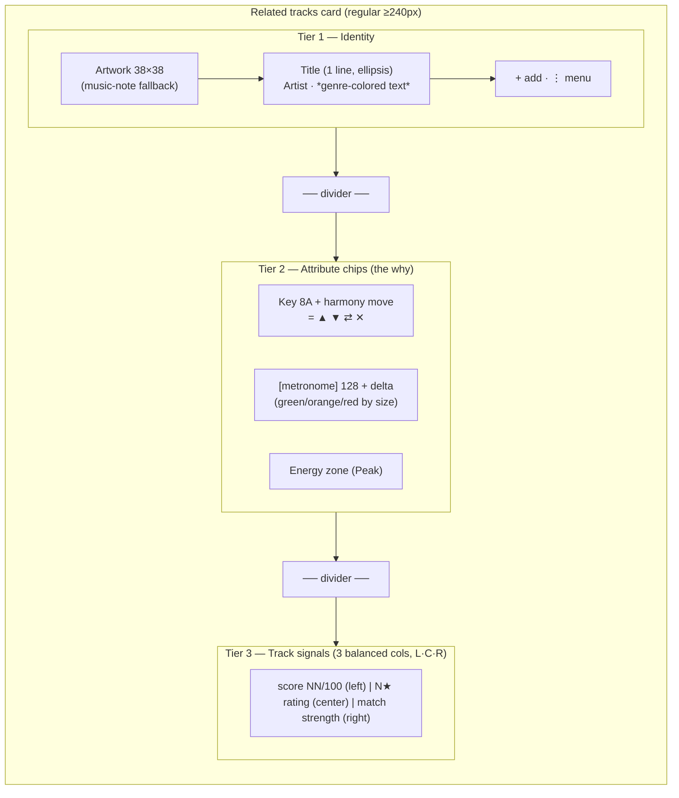

# Track Card — Guidelines (two modes)

The **Track card** is the densest information surface in Kiku — one scannable
tile that reads a track top-to-bottom. It runs in **two modes** off **one shared
shell** so the DJ learns one card and reads it everywhere:

| Mode | Component | Asks | Lives where |
|------|-----------|------|-------------|
| **Related** | `library/SimilarTrackCard.svelte` | "What mixes well from *here*, and *why*?" | the **Related tracks** section (`waveform/SimilarTracks.svelte`) on the track view |
| **Standalone** | `library/StandaloneTrackCard.svelte` | "What *is* this track?" | anywhere a single track stands on its own — a library card grid, a search result, a header |

Both wrappers are thin: they bind their props into a discriminated `mode` union
and delegate to the shared base **`library/TrackCard.svelte`**, which owns the
3-tier shell, artwork + fallback, `capFirst` capitalization, the container-query
tiers and every token. The shell is **identical** in both modes; only **Tier 2
and Tier 3 swap** (see [Mode differences](#mode-differences)).

> **Why two modes, not two cards.** A related card is *comparative* — every
> number on it (harmony move, BPM delta, match score, affinity) is measured
> *against a reference track*. A standalone track has no reference, so those
> signals would be **phantoms**. Splitting the modes by a union means the
> standalone card *structurally cannot* render a score it can't justify — that is
> "Opinions You Can See Through" enforced by the type system, not by discipline.

This doc covers what is **specific** to this card. For everything shared —
capitalization, overflow, number formatting, color-as-meaning, states,
iconography, motion, terminology, composition — see
[`content-conventions.md`](./content-conventions.md). Those rules apply here
without restatement; this doc only notes where the card *applies* or *narrows*
them.

---

## When to use each mode

- **Reach for Related** when the track is being weighed *against another* — the
  "what comes next" suggestions under a now-playing or selected track. The
  comparison *is* the point; the card exists to show the *why* of a transition.
- **Reach for Standalone** when the track stands alone — browsing the library as
  a card grid, a search result, or presenting a single track's identity and
  quality. There is no "from" track, so the card must not invent a score. If you
  find yourself wanting to show a match number on a standalone card, that is the
  signal you actually have a *reference track* and want Related mode.
- **Never** hand-roll a track tile. Both modes are the same primitive; a bespoke
  row drifts from the shared anatomy, capitalization and tokens.

---

## Mode differences

Tier 1 (identity) is **byte-for-byte identical** across modes. Tiers 2 and 3 swap:

| Tier | **Related** (comparative) | **Standalone** (absolute / own quality) |
|------|---------------------------|------------------------------------------|
| **2 — attributes** | Key chip + **harmony-move glyph** + harmony-derived color · BPM chip + **signed delta** (green/orange/red) · energy zone | Key · BPM · energy zone as **bare `plain`-mode colored text** — **no harmony glyph, no delta**. The color carries the meaning; the values are facts, not transitions. |
| **3 — signals** | Match **score `NN/100`** (lead) · `N★` rating · **affinity strength** bar | The track's **own quality read**: `N★` rating (lead) · **play count** · **energy settledness** (Settled / Inferred / —). **No score, no affinity, no harmony** — there is no reference. |
| **compact pill** | harmony · metronome · **match-strength bars** · `N★` | key dot · metronome · `N★` — **no match bars** |

The standalone Tier-2 chips use the `plain` `<Chip>` mode (bare colored text, no
box) — these are descriptive facts, lighter than the related card's transition
chips. The standalone Tier-3 columns reuse the same three-balanced-column grid as
Related, so a mixed grid of cards still reads as aligned columns.

**Standalone "energy settledness"** is the honest standalone analogue of the
related card's match strength — it reads the track's *own* confidence, not a
pair-wise verdict:

| Energy source | Word | Color | Meaning |
|---------------|------|-------|---------|
| `approved` | **Settled** | `--score-excellent` | you confirmed this zone |
| inferred | **Inferred** | `--score-good` | Kiku's read, not yet approved |
| none | `—` (muted) | `--text-3` | no zone yet — never a blank gap |

---

## Anatomy (Related mode)

The card stacks three tiers, separated by dividers, reading top-to-bottom from
*what it is* → *why it fits* → *how good + what to do*. At its **regular** width
all three tiers show; the card **restructures** at narrower container widths (see
[Responsive tiers](#responsive-tiers)).

- **Tier 1 — Identity**: artwork → title → **artist · genre-colored text** subtitle. Who is
  this track? Plus the per-card actions (`+` add to set, `⋮` `<Menu>`). Title is one line,
  first-letter-capped, full value on hover. **Genre lives here**, not in the chip row:
  it is descriptive identity metadata, not a transition signal, so it belongs with the
  artist on the subtitle line. Genre is rendered as **genre-family-colored text** (no box /
  background / border) — the color *is* the signal, keeping it lightweight on the dense
  line. The artist is plain muted text that ellipsizes first under width pressure.
- **Tier 2 — Attribute chips / the "why"**: the harmonic and energetic reasons it
  fits, as `<Chip>`s in priority order key → BPM → energy — Camelot key +
  harmony-move icon, a **metronome glyph + integer BPM + signed delta** (no literal
  "BPM" text), energy zone. This tier is the card's reason to exist; it's "Show the
  Why" made visible. See [Chips](#chips).
- **Tier 3 — Track signals**: the quality verdict (match score), the DJ's own
  rating (compact `N★`), and affinity-as-strength — see
  **[Track signals block](#track-signals-block)**.

---

## Title, artist & genre

- **Title** is one line, ellipsis on overflow, **no wrap**. (This replaced the old
  2-line `-webkit-line-clamp: 2`.)
- **Artist and genre share one identity subtitle line**, separated by a muted `·`. The
  artist is plain muted text; **genre is genre-family-colored TEXT** (no box / background /
  border), placed after the artist (e.g. `Lena Vox · Techno`, the word "Techno" colored).
  Genre was kept out of the chip row because it is descriptive metadata, not a transition
  signal — it belongs with *who the track is*, beside the artist. An earlier pass tried a
  genre **chip** here, but the box read too heavy on this dense line and a plain muted-grey
  fallback was invisible; **colored text** is the resolution — visible without weight, the
  color carrying the meaning. The artist takes priority and **ellipsizes first** under
  width pressure (`flex-shrink: 1`); the **genre word holds its width** (`flex-shrink: 0`)
  then 1-line ellipsis + `title` if it overflows on its own. When genre is missing, only
  the artist shows. Genre stays at **regular + intermediate** tiers and is hidden **only at
  compact** (see [Responsive tiers](#responsive-tiers)).
- The genre text color comes from the tokenized `--chip-genre-fg` (the genre color from the
  system-wide genre treatment, derived from `--accent-text`) — so it is **cerceta-aware**
  automatically and never hardcodes hex. The card has no per-family token set; this one
  genre color token is the single source.
- Full value exposed on hover/focus via `title` on the artist span and the genre span
  (per [content-conventions §2](./content-conventions.md#2-overflow--wrapping)).
- Title and artist are **first-letter-capped** via the shared `capFirst()` helper —
  the first visible character is forced to a capital, the rest of the string is left
  intact (so `deadmau5` → `Deadmau5` but `MEDUZA` stays `MEDUZA`). This is a USER
  DECISION (spec 023) that overrides the previous "preserve source casing" default;
  the underlying library value is never mutated and the full original is still on
  hover (per [content-conventions §1](./content-conventions.md#1-capitalization)).

---

## Chips

Tier 2 renders a row of chips in a fixed **priority order**:

1. **Key** (Camelot + harmony move) — the harmonic relationship is the strongest
   "why." Transition-critical; always shown.
2. **BPM** (metronome + integer + signed delta) — tempo compatibility.
   Transition-critical; always shown.
3. **Energy** (zone) — where it sits in the journey. Lowest priority; it is the
   first chip to **drop at the compact tier** (it stays at regular **and**
   intermediate — the compact metronome glyph keeps all three chips fitting).

Genre is **not a Tier-2 chip** — it lives in the identity tier as genre-family-colored
text (see [Title, artist & genre](#title-artist--genre)).

All are the shared `<Chip>` primitive (`variant="key|bpm|energy"`) — no bespoke pills.
The key chip carries a `<HarmonyIcon>` glyph for the move.

**BPM as a metronome icon.** The `bpm` `<Chip>` variant leads with a **metronome glyph
(`<MetronomeIcon>`)** instead of a literal "BPM" text label, to save horizontal width in
the dense chip row. It renders `[metronome] 128 +1` — glyph, integer tempo, signed
colored delta. The meaning is preserved without the text: the icon is meaning-bearing,
the integer is present, and the chip's `title` (and the icon's `aria-label`, defaulting
to "BPM") carry the tempo meaning for screen readers — so color/text is never the only
signal (§4). This is a **system-wide** bpm-chip change (the metronome auto-renders for
the `bpm` variant), so every migrated bpm chip is consistent.

**BPM delta color scale (green / orange / red).** The signed delta is **colored by
magnitude** per Kiku's tempo rules, so the DJ reads "how far is this tempo?" at a glance:

| Delta magnitude | Meaning | Color token |
|-----------------|---------|-------------|
| ≈ within **±6%** | **Seamless** | `--score-excellent` (green) |
| ~**6–12%** | **Moderate** shift | `--score-good` (orange) |
| > ~**12%** | **Tension** (big jump) | `--score-poor` (red) |

The color is applied to the delta number on the card via `bpmDeltaColor` (a tokenized
value, no hardcoded hex) and is **always paired with the signed number** (and the chip's
`title`, e.g. "+18 BPM faster — big jump"), so color is never the only cue (§4). The same
three-state strength drives the compact-tier metronome icon color. The `/design-system`
showcase shows the three states side by side (seamless / moderate / tension).

**Responsive tiers**
- The card is a **size container** (`container-type: inline-size`, `container-name:
  relcard`), so it adapts to the card's **real laid-out width** — whatever grid density
  it lands in — through three container-query tiers, **not** one shrinking design.
- Chips **never shrink** (`flex-shrink: 0`), so a chip is **never clipped mid-word** at
  any width. Whole chips are hidden by priority instead. See
  [Responsive tiers](#responsive-tiers) for the full breakdown.
- Chip colors come from **semantic tokens by meaning** (the `--zone-*` set for
  energy, `--score-*` for the harmony band **and the BPM delta's green/orange/red
  magnitude scale**) — never hardcoded pastel hex. Genre (now identity text,
  not a chip) uses `--chip-genre-fg`.
- Each color-coded chip pairs color with text/glyph (zone name, harmony glyph,
  signed delta, metronome glyph), per §4.

---

## Responsive tiers

The card restructures across **three container-query tiers** keyed off its own inline
size (`@container relcard`), so it works at any grid column width (4-up, 5-up, 6-up,
expanded). Nothing is ever clipped mid-word; tiers hide whole elements or restructure.

| Tier | Container width | Shows | Hides / changes |
|------|-----------------|-------|-----------------|
| **Regular** | ≥ 240px | Everything: identity (artist · **genre-colored text**), chips **key → BPM → energy**, three-balanced-column signals (`NN/100` left · `N★` center · match right). | — |
| **Intermediate** | 200–240px | Identity (artist · **genre-colored text — KEPT**), **all three chips key + BPM + energy — KEPT**, three-column signals (L · C · R). | **Tighten only**: smaller artwork, tighter padding/gaps. **No chip drops, no `+1`** — the compact metronome glyph keeps the BPM chip short enough that key + BPM + energy all fit. |
| **Compact** | < 200px | **Dense PILL** (rounder, badge-like). **Top**: small artwork + 1-line title (+ `⋮` if it fits). **Below**: a single row of **color-coded ICONS only**, **evenly distributed** across the pill (`justify-content: space-between`) — harmony glyph · metronome · match-strength bars · a **larger, bold `N★`** (`size="md"`). | The numeric **score**, **key text**, **BPM number**, **genre**, **energy**, the `+` action, both dividers and the whole chip + signals rows all hidden. Icon **shape + color + star count** carry the signal; each icon's real value lives in its `title`/aria-label. |

- The container queries are placed **last** in the stylesheet so they win over the base
  (regular) rules by source order (container queries add no specificity).
- The chip row is still **no-wrap** with `overflow: hidden` as a **final safety net
  only** — the tiers are what actually prevent clipping.
- At compact the match is an **icon** (the colored strength bars), not text — so the wording
  is irrelevant there; the value is in its `title`/aria-label. The icon row is legible with
  no overlap down to ≈180px. The compact card is rounder (`--radius-full`) so the dense
  variant reads as visually distinct from the regular card.
- The compact icons are **evenly distributed** across the pill (`justify-content:
  space-between`) — harmony · metronome · match-bars · `N★` each own a balanced slot, rather
  than bunching left with the star flung to the far edge (the stars no longer use
  `margin-left: auto`).
- The compact `N★` is rendered **larger** (`<StarRating display="compact" size="md">`, up
  from `sm`) so it holds its own against the icon row, and its **count number is bold**
  (`--font-weight-semibold`, `--text-1`) — matching the weight of the score/rating numbers
  in the regular card. The bold-count rule is **card-scoped** (`:global(.star-compact__count)`
  under `.cicon-stars` and `.signal-rating`), so `StarRating.svelte` is untouched and other
  compact-star sites keep their normal weight. The star glyph itself stays normal weight.

---

## Track signals block

> **STATUS: LOCKED — built in `SimilarTrackCard.svelte` (spec 023, step 5).**

Tier 3 groups the three "how good is this?" signals into **one readable unit**
named **"Track signals."** Previously the match score and stars sat in Tier 3
while the affinity signal lived as a separate dot up in Tier 1; they are now one
left-to-right cluster so the DJ reads the full verdict — *our score, your rating,
your call* — in a single glance.

**What it consolidates**
- **Match score** — `NN/100`, the tool's compatibility verdict.
- **Rating** — the DJ's own rating as a compact `N★` (`StarRating display="compact"`).
- **Affinity strength** — a labelled qualitative strength, NOT a raw number.

**Layout** (token-based, no literals) — **three BALANCED columns**,
`display: grid; grid-template-columns: repeat(3, minmax(0, 1fr)); align-items: center;
gap: var(--space-sm)`, with the same `--space-sm var(--space-md)` padding as the other
tiers. Each signal gets an **equal third** so cards in a row read as **aligned columns**
with no bunch-left + dead-gap-right; the per-column content alignment reads
**left → center → right** like a table:

1. **Score `NN/100` (column 1 — lead anchor, heaviest; aligned START/LEFT)** — `NN` at
   `--text-lg`, `--font-weight-semibold`, `--text-1`; suffix `/100` at `--text-xs`,
   `--text-3`. It is the headline verdict, so it carries the most weight.
2. **Rating (column 2 — aligned CENTER)** — `<StarRating display="compact" size="sm" />`
   → `N★` when `rating > 0` (the DJ's curation signal beside the tool's verdict), centered
   in its middle third so the row balances; when unrated, the canonical muted `—`
   (content-conventions §3), never a blank gap. The **count number is bold**
   (`--font-weight-semibold`, `--text-1`) here too, consistent with the larger compact-pill
   `N★` (card-scoped CSS; `StarRating.svelte` untouched).
3. **Match strength (column 3 — aligned END/RIGHT)** — a small 3-segment **strength bar +
   TERSE word** (`justify-content: flex-end`), mapping the match score onto a qualitative
   band so the row never shows a second raw number competing with `NN/100` (§3) and never
   relies on color alone (§4). The visible word is a single short token —
   **Great** (Strong tier or a `good` opinion) / **Likely** / **Weak** / **Not for me**
   (a `bad` opinion) — deliberately terse so the column fits cleanly at both regular and
   intermediate; the fuller phrasing ("Great together · Strong match") is in the `title`
   tooltip. Sitting at the trailing edge of its third eliminates the old awkward gap (the
   previous `auto auto minmax(0,1fr)` flung match far right of bunched score+stars).

**Responsiveness**: because every column is `minmax(0, 1fr)` and the affinity bar is
`flex-shrink: 0`, at narrow card widths (≈210px / 6-up) the match **word ellipsizes**
within its third while the bar stays intact — the three columns never overlap and never
force the row wider than the card. The narrow `@container` query also trims the gap.

**Affinity-strength thresholds** (`scoreStrength()` in `SimilarTrackCard.svelte`),
derived from the match score (0–1):

| Score | Strength (`scoreStrength`) | Visible terse word | Bars | Color token |
|-------|---------------------------|--------------------|------|-------------|
| ≥ 0.80 | Strong | **Great** | ███ (3) | `--score-excellent` |
| ≥ 0.55 | Likely | **Likely** | ██ (2) | `--score-good` |
| < 0.55 | Weak | **Weak** | █ (1) | `--score-poor` |

A DJ-set opinion overrides the word: `good` → **Great**, `bad` → **Not for me** (the bars
still reflect the score). The thresholds/mapping are unchanged — only the displayed word is
terse.

**Degradation**
- No score → `—` in the score slot (never blank).
- No rating → muted `—` in the rating slot.
- Explicit affinity set → the word shows the terse opinion (**Great** / **Not for me**);
  the bar still reflects score.
- Space-constrained → keep score (the headline); the terse match word stays whole in its
  `1fr` column while the bar stays intact. At compact the match becomes an icon (the bars),
  so wording is irrelevant.

**Why**: grouping the tool's score next to the DJ's own rating and a plain-language
strength read reinforces "Opinions You Can See Through" — the DJ sees *why* and can
argue back, without two numerics fighting for the same glance.

---

## Standalone mode

The standalone card shares Tier 1 with Related verbatim, then **swaps Tiers 2 and
3** for the absolute, no-reference reads (full table in
[Mode differences](#mode-differences)).

**Tier 2 — absolute attributes.** Key, BPM and energy zone, each a `plain`-mode
`<Chip>` (bare colored text, no box / border / fill). There is **no harmony-move
glyph** and **no BPM delta** — both are pair-wise, and a standalone track has no
pair. The key chip's color is the *absolute* Camelot color (the wheel position),
not a harmony-quality color; energy keeps the shared `--zone-*` color. Lighter
than the related chips on purpose: these are facts, not transition signals.

**Tier 3 — the track's own quality read.** The same three-balanced-column grid,
reading left → center → right:

1. **Rating (lead, left)** — the DJ's `N★` (`StarRating display="compact"`). In
   standalone mode the rating *is* the headline (there is no score to outrank it),
   so it aligns START. Unrated → the canonical muted `—`, never a blank gap.
2. **Plays (center)** — total play count (Rekordbox + Kiku), the DJ's own usage
   signal. Never played → muted `—`.
3. **Energy settledness (right)** — Settled / Inferred / `—`, the track's own
   energy-read confidence (see the table in [Mode differences](#mode-differences)).
   A word + tokenized color, never color alone (§4); the full meaning is in the
   `title`.

**What is deliberately ABSENT.** No match `NN/100`, no affinity strength bar, no
harmony move — every one of those is a comparison with a reference track the
standalone card does not have. They are not "hidden"; the `standalone` arm of the
mode union simply doesn't carry the fields, so they *cannot* render. This is the
"Show the Why" / "Opinions You Can See Through" principles made structural: the
card only ever shows a signal it can stand behind.

**Compact pill.** Artwork + title, then a single evenly-distributed icon row —
**key dot · metronome · `N★`** (no match-strength bars). Each icon keeps its real
value in its `title`/aria-label.

---

## States

Per [content-conventions §5](./content-conventions.md#5-states). Card-specific
behavior:

| State | Behavior |
|-------|----------|
| **Default** | Resting card; `--surface-2`, `--border-subtle`. |
| **Hover** | `border-color: var(--border-strong)`; transition via `--dur-fast`. |
| **Focus-visible** | Keyboard ring from the global `--focus-ring` rule (card is `role="button"`, `tabindex="0"`). |
| **Selected** | *Removed (spec 023 follow-up).* The card had a dead `isSelected` state + `.selected` rule that was never set true; there is no card-local selection concept (selection is via `ui.selectedTrack` / tab switch), so it was dropped rather than wired. |
| **No-artwork fallback** | Inline music-note SVG in `--text-4` on `--surface-1`. |
| **Affinity set/unset** | Set → the Tier-3 strength word reads the terse opinion (**Great** / **Not for me**) with the full opinion + strength in `title`; unset → the terse word reads the score band (**Great** / **Likely** / **Weak**). At compact this verdict is the colored match-bars icon, value in its `title`/aria-label. |
| **Loading** | Owned by the wrapper: `<Spinner label="Finding what mixes..." />`. |
| **Empty** | Owned by the wrapper: muted "Nothing in your library mixes cleanly from here yet". |

**Keyboard reachability**: the `+` and `⋮` actions live in Tier 1 and must remain
Tab-reachable and show on focus (content-conventions §5) — they are not
hover-only. (At the compact pill the `+` action drops; the `⋮` menu stays, so
every action still has a reachable home — the full-size card.)

---

## Tokens used

The card consumes the semantic layer (`frontend/src/lib/styles/tokens.semantic.css`)
exclusively. No px/hex literals.

| Category | Tokens |
|----------|--------|
| Surfaces | `--surface-1`, `--surface-2`, `--surface-3`, `--surface-hover` |
| Text | `--text-1`, `--text-2`, `--text-3`, `--text-4` |
| Borders | `--border-subtle`, `--border-strong` |
| Accent / status | `--accent` (selected/primary action), `--destructive` (bad affinity), zone/status ramp for energy chips, `--chip-genre-fg` (genre-colored identity text, derived from `--accent-text`), `--icon-size-*` + `--icon-stroke` (harmony + metronome glyphs) |
| Spacing | `--space-2xs`, `--space-xs`, `--space-sm`, `--space-md`, `--space-lg`, `--space-xl` |
| Type | `--text-2xs` … `--text-lg`, `--lh-*`, `--font-weight-medium/semibold` |
| Radius | `--radius-md` (artwork), `--radius-sm` (buttons), `--radius-full` (chips/dots), `--radius-xl` (card) |
| Motion | `--dur-fast`, `--ease-standard` |
| Elevation | `--elev-3` (add-to-set popover) |

**Outstanding debt**: the hardcoded `PHASE_PILL_COLORS` / delta-badge pastel hex
are **gone** — chips now derive color from the `--zone-*`, `--score-*` (incl. the BPM
delta's green/orange/red magnitude scale) and `--chip-genre-*` token sets via `<Chip>`.
The remaining non-token literals are the
artwork's `38px` (and the responsive `30px`/`28px` artwork steps), the popover's
`220px min-width`, and the two **container-query tier breakpoints** (`240px`
intermediate, `200px` compact) — intentional raw layout thresholds that encode measured
fit-widths rather than design-token steps.

---

## Open items

Resolved (spec 023, step 5):

1. ~~**Title casing**~~ — **RESOLVED**: titles/artists are now **first-letter-capped**
   (`capFirst()`), overriding preserve-source. `deadmau5` → `Deadmau5`.
2. ~~**"Track signals" block**~~ — **RESOLVED**: built as the locked
   [Track signals block](#track-signals-block); the Tier-1 affinity dot was removed
   and affinity moved to Tier 3 as a labelled strength.
4. ~~**Chip drop order / responsiveness**~~ — **RESOLVED**: genre lives in the identity
   tier as **genre-family-colored text** (regular + intermediate; hidden at compact); the
   chip row is key → BPM(metronome) → energy. The card uses **three container-query tiers**
   (regular ≥240px / intermediate 200–240px / compact <200px — see
   [Responsive tiers](#responsive-tiers)) rather than one shrinking design: at intermediate
   it only tightens (all three chips stay, no `+1`), energy drops only at compact, and at
   compact the card becomes a dense **pill** with a single row of **evenly-distributed
   color-coded icons only** (harmony · metronome · match-bars · `N★`; numbers/text/genre/
   energy gone). Never clipped mid-word. Demonstrated at all three widths in the
   `/design-system` showcase.
5. ~~**Zone/status color tokens**~~ — **RESOLVED**: chips consume `--zone-*` and
   `--score-*` tokens (the latter also drives the BPM delta's green/orange/red magnitude
   scale); no hardcoded hex remains on this card.

3. ~~**Selected state**~~ — **RESOLVED (dropped)**: `isSelected` was dead (never
   set true) and there is no card-local selection concept — selection lives in
   `ui.selectedTrack` / the tab switch, not a per-card boolean. The `isSelected`
   state and the `.selected` rule were removed when the shared base
   (`TrackCard.svelte`) was factored out. If a real multi-select concept ever
   lands, wire a `selected?: boolean` onto the shared shell rather than reviving
   a dead local.
