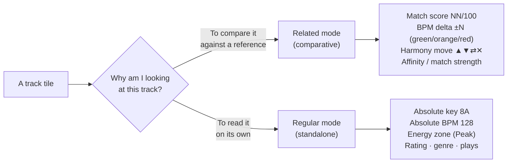

# UI/UX Further Improvements — Backlog

## Context

Spec 023 gave Kiku a real design system: a 3-tier token architecture (primitive →
semantic → component), the cerceta flip (the old cyan accent retired for teal across
every surface), and an app-wide migration of buttons, chips, menus, ratings and icons
onto shared primitives. It also reshaped the shell — a 12-column grid, sticky toolbar
bands, and density tuning so cards breathe at any column count, plus a rebuilt Related
tracks card that answers "why does this mix?" in one scannable tile. The closeout sweep
came back green: type-check 0/0, production build clean, primitives adopted everywhere
they belong.

This doc is the forward-looking backlog — everything we deliberately left for later,
plus improvements this work surfaced. It is not a record of what shipped; it is the list
the next person works from. Items are grouped by theme and prioritized at the end. Every
entry names the files involved so you can start without re-discovering the ground.

---

## 0. Recently shipped (2026-06-30)

Two commits on branch `design-system` (not yet pushed/merged) cleared the P0 wave, most
of P1, and a focused slice of P2. Shipped items below are marked **✅ SHIPPED** inline and
in the §5 table; everything unmarked is still the live backlog.

- **`736f865` — P0 + P1 + UX-pass.** P0 hygiene (1.1 delete 3 orphaned `set/` comps · 1.3
  cyan→teal canvas fallbacks · 1.4 `app.css` comment · 1.6 dead `isSelected` dropped). P1
  (2.1 Chip `plain`/`tone`/`clickToRemove` modes · 2.2 `StarRating`→primitive · item 3
  two-mode `TrackCard` + `StandaloneTrackCard` · 4.1/4.2 sticky bands + header consistency
  across Track/DNA/Tinder/Hunt/Albums · 4.6 empty/loading/error states in Kiku voice).
  UX-pass fixes: **F1** `role="alert"` on 7 error surfaces · **F2** `clickToRemove` ≥44px
  hit area · **F3** tone-chip AA contrast.
- **focused-P2 follow-up (this commit).** §2.5 resolved → Option 1 (consolidate):
  `chartPalette.ts` → `lib/styles/canvasPalette.ts` with `deviationColors()` /
  `spectrumBands()`, `EnergyFlowChart` + `WavesurferPlayer` de-literalized. Canvas chart
  a11y (part of §4.8): every `<canvas>` now carries a screen-reader summary, and
  `EnergyFlowChart`'s color-only fit-quality cue is fixed. Reusable `use:focusTrap` action
  (`lib/actions/focusTrap.ts`) applied to 4 bespoke modals (`ReplaceTrackModal`,
  `AddFromArtistPanel`, `FillReorderDialog`, `SetEnergyReview`).

Validation (both green): svelte-check 335 files / 0 errors, `npm run build` clean,
ui-ux-pro-max UX pass PASS, Playwright visual LOOKS GOOD.

---

## 1. Hygiene / cleanup

Low-risk debt to clear before it calcifies. None of these block the spec-023 PR.

### 1.1 — ✅ SHIPPED (736f865) — Remove the three orphaned `set/` components

Zero callers anywhere; safe to delete outright.

- `frontend/src/lib/components/set/SetAnalysisView.svelte`
- `frontend/src/lib/components/set/SetSelector.svelte` (also carries stale `#000`/`#fff` hex)
- `frontend/src/lib/components/set/SuggestNextPanel.svelte`

### 1.2 — Decide the two Mood components (deletion candidates)

Both depend on mood data (happy/sad/etc.) that **was never populated** and is superseded
by the vibe system (brightness + density). They render empty or never render.

- `frontend/src/lib/components/dna/MoodScatter.svelte` — mounted unconditionally in
  `DnaView.svelte`, draws an empty chart. Also referenced by `lib/api/stats.ts`.
- `frontend/src/lib/components/tinder/MoodRadar.svelte` — gated behind `mood_* != null`,
  which never fires, so it never renders.

Recommendation: delete both alongside the vibe-vs-mood deprecation already tracked in
project memory. If kept, they need a real data source first.

### 1.3 — ✅ SHIPPED (736f865) — Re-point stale cyan canvas fallbacks to teal

`--accent` is flipped to teal, but a few runtime canvas fallbacks still hold the old cyan
hex. They only fire if `getComputedStyle` fails, so this is latent inconsistency, not an
active bug — but it should match.

- `EnergyFlowChart.svelte:76` — `rgba(64, 224, 208, 0.9)` (the "no target" status fallback)
- `WavesurferPlayer.svelte:156-157` — `resolveColor('var(--accent)', '#00CED1')`
- `NowPlayingBar.svelte:122-123` — same pattern, `'#00A8AB'`

### 1.4 — ✅ SHIPPED (736f865) — Fix the stale comment in `app.css:7`

Reads "`--accent stays CYAN until the deliberate flip`". The flip already happened in
`tokens.semantic.css` (`--accent-9: var(--teal-600)`). Correct or delete the comment.

### 1.5 — Split the oversized build chunk

`npm run build` warns: `nodes/2.BulEn_uk.js` is 521 kB, over Vite's 500 kB threshold.
Non-blocking, but worth a `manualChunks` split or a route-level dynamic import to keep
first-load lean. Ties to Kiku's efficiency principle.

### 1.6 — ✅ SHIPPED (736f865) — Wire or drop the dead `isSelected` state on the Related card — DONE (dropped)

`SimilarTrackCard.svelte` declared `isSelected` and styled `.selected`, but the prop was
never set true. **Resolved:** dropped (no card-local selection concept — selection lives
in `ui.selectedTrack` / the tab switch). Removed when the shared base `TrackCard.svelte`
was factored out for the two-mode card (§3). If a real multi-select concept ever lands,
add a `selected?: boolean` to the shared shell rather than reviving a dead local.

---

## 2. Design-system completeness

The migration is broad but not total. These close the remaining gaps so the system can
express every surface without bespoke fallback.

### 2.1 — ✅ SHIPPED (736f865) — Add the three missing Chip modes

Several sites are blocked purely because `Chip` can't yet express their shape. Adding
these unblocks the whole chip leftover wave at once:

| Mode | What it does | Unblocks |
|------|--------------|----------|
| `plain` | Bare colored text, no box/border | `SetTrackCard`, `ReplaceTrackModal`, `SuggestNextPanel`, `TransitionDetail` dense meta labels |
| `tone` | Tinted bg + fg (not outline) | `HuntResults` owned/gap badges, `SetComparison` kind/energy, `LibraryGaps` swatches |
| `clickToRemove` | Whole chip is the remove button | `SearchFilters` removable filters (24 sites), `Typeahead` selected chips |

`SearchFilters.svelte` is the single largest un-migrated file and depends on
`clickToRemove`. Note: the Related card already resolved its own genre treatment to
*colored text* rather than a chip — `plain` would formalize that pattern systemwide.

### 2.2 — ✅ SHIPPED (736f865) — Promote `StarRating` to a primitive

`StarRating` lives at `lib/components/library/StarRating.svelte` but behaves as a
primitive (5 import sites). Relocate it to `lib/components/primitives/` (or formally
bless it), then migrate the remaining inline `★` markup in `SearchFilters`, `TasteRadar`,
and `SetView`.

### 2.3 — Button variants for controls the primitive can't express

The Button primitive is a 36px pill. Two surfaces were left tokenized-but-bespoke because
they need shapes Button doesn't offer:

- **Tab variant** — the workspace tab-bar (6 tabs) carries underline-active state and
  keyboard-shortcut spans. A `tab`/segmented variant would let it migrate.
- **Icon-only / round / `title` passthrough** — the transport controls (`NowPlayingBar`,
  `SetPlaybackBar`: 8 round 28–34px icon buttons with tooltip `title`s) can't be a 36px
  pill. A round icon-button mode unblocks the transport migration.

### 2.4 — Finish the Menu migration

- `TrackContextMenu.svelte` rows aren't yet refactored onto `<MenuItem>`, and its
  submenus (energy zone, add-to-set) aren't true accessible submenus. (The standalone
  `EnergyZonePicker` and `AddToSetPicker` pickers were already migrated.)

### 2.5 — ✅ SHIPPED (this commit) — A data-viz / canvas palette decision

**Resolved → Option 1 (consolidate), implemented.** The shared `chartPalette.ts` was
renamed/relocated to `lib/styles/canvasPalette.ts` and is now the single source of truth
for canvas colors. The previously-scattered status palettes moved in behind named helpers:

- `EnergyFlowChart` deviation rgba (green/yellow/red) → `deviationColors()`
- `WavesurferPlayer` frequency-band spectrum hexes → `spectrumBands()`

Both consumers are de-literalized and resolve through the module (cerceta-aware via the
existing `resolveColor` step). The next recolor is now a one-file change.

### 2.6 — Tokenize remaining one-off constants (where it pays)

Most literals are gone. The intentional ones left (the Related card's `38px` artwork,
`220px` popover min-width, container-query breakpoints `240px`/`200px`,
`--waveform-block-h: 166px`) encode *measured fit-widths*, not design steps — leave them.
Audit any new one-offs against that bar before tokenizing for its own sake.

---

## 3. ✅ SHIPPED (736f865) — The two-mode Track card

Built: shared `library/TrackCard.svelte` base, discriminated-union `mode`, the two thin
wrappers (`SimilarTrackCard` = related, `StandaloneTrackCard` = standalone), and the
generalized `track-card.md` docs. Only step 5 (adopting `StandaloneTrackCard` into the
TrackView header / search results / library lists) is deferred — see the per-step notes
below; those editor surfaces belong to a later shell + states wave.

This was the biggest unbuilt thread. The Related card was built; its standalone twin was
documented in intent but never made. The card has two jobs that look similar but answer
different questions, and conflating them weakens both.

### The model

- **Related mode (built)** — `SimilarTrackCard.svelte`. Everything is *relative to a
  reference track*: the harmony **move**, the BPM **delta**, the **match score** and
  **affinity strength**. It answers "what mixes from here, and why?" These signals only
  mean anything next to an anchor.
- **Regular mode (proposed)** — a standalone tile for a track viewed on its own (search
  results, library lists, the TrackView header). It should show **absolute attributes**:
  the actual key, actual BPM, energy zone, rating, genre, play count. It must **not** show
  comparative deltas, a harmony-move glyph, a match score, or affinity strength — there is
  no reference to compare against, so those signals would be meaningless or misleading.

The sharp distinction: **the standalone variant has no `NN/100` score.** A match score is
a comparison; with nothing to compare to, it doesn't exist. (Today the TrackView card
shows the score only buried in metadata — the standalone model says: don't show it at all,
show the track's own quality signals instead — rating, plays, energy fit to its zone.)

### Build outline

1. **Factor the shared shell** out of `SimilarTrackCard.svelte` — **DONE**. The 3-tier
   anatomy (identity → attributes → signals), artwork fallback, capitalization, responsive
   container-query tiers and token usage now live in the shared base
   `library/TrackCard.svelte`.
2. **Parameterize by `mode`** — **DONE**, as a **discriminated union** `mode: { kind:
   'related'; ... } | { kind: 'standalone'; track }` (no cast/`!`), with two thin wrappers
   (`SimilarTrackCard.svelte` = related, `StandaloneTrackCard.svelte` = standalone) over
   the shared base. Tier 1 identical; Tiers 2/3 swap.
3. **Standalone Tier 2** — **DONE**. Absolute Key / BPM / Energy as `plain`-mode `<Chip>`s
   (no delta, no harmony glyph).
4. **Standalone Tier 3** — **DONE**. Rating (`N★`, lead) + play count + energy
   settledness (Settled / Inferred / —). No `NN/100`, no strength bars, no harmony move.
5. **Adopt it** — **PARTIAL / follow-on**. `StandaloneTrackCard` is live and demoed in the
   `/design-system` showcase. Adopting it into the **TrackView header**, **search results**
   and **library lists** is deferred: those surfaces are either *interactive editors*
   (the TrackView header has an editable rating, an interactive zone picker, play +
   add-to-set — a card would regress them), *deliberately dense tables*
   (`TrackTable.svelte` — the doc and the audit both keep it a table), or *comparative*
   (`InSetTrackSearch.svelte` scores against a `lastTrackId`, so it is Related-shaped, and
   still carries raw hex). These row replacements belong with the later **shell + states**
   wave, which can redesign those editor surfaces deliberately rather than as a side effect
   of a card-primitive wave.
6. **Generalize the docs** — **DONE**. `related-tracks-card.md` → `track-card.md`, now the
   single two-mode source of truth (When to use each · Mode differences · Related anatomy ·
   Standalone mode).

This directly serves **Show the Why** (each mode shows the signals that are actually
meaningful in its context) and **Opinions You Can See Through** (no phantom score where
there's nothing to score against).

---

## 4. UX improvements

Enhancements this work surfaced, each tied to a Kiku principle.

### 4.1 — ✅ SHIPPED (736f865) — Per-surface sticky band rhythm (consistency pass)

Only the Set tab has the sticky `--band-toolbar-h` / `--band-secondary-h` rhythm. The
Track, DNA, Tinder, Hunt, and Albums tabs lack the same toolbar bands, so headers feel
different per tab. Define each tab's band and apply the sticky pattern uniformly. A calm,
predictable shell lets the DJ stay mid-flow rather than re-learning each tab.

### 4.2 — ✅ SHIPPED (736f865) — Header consistency across tabs

Related to 4.1: the navbar moved to `+layout.svelte`, but per-tab secondary headers
(filter rows, search rows, titles) were only formalized on the Set tab. Run a consistency
pass so every tab's header reads from the same spacing/typographic recipe.

### 4.3 — Collapsible energy chart on the set view

`EnergyFlowChart` is a dense canvas chart that dominates the set view vertically. Offer a
collapse/expand toggle so the DJ can fold it away when working the timeline and reopen it
to read the arc. Serves **The Arc Over the Moment** — the chart is the set's narrative
made visible; let the DJ pull it up when thinking about the journey.

### 4.4 — Collapsible / fluid sidebar

The library sidebar is a fixed 500px. Consider trimming to ~360–420px (frees grid breadth
for the content pane) and/or a collapse toggle that hands the content pane all 12 columns
on demand. Improves density on smaller screens without a separate mobile layout.

### 4.5 — Navbar tab overflow handling

At narrow widths, logo + 6 tabs + future right-actions will crowd. Decide now: horizontal
scroll, condensed labels, or collapse-to-icons. Recommend scroll-or-condense so tabs never
clip.

### 4.6 — ✅ SHIPPED (736f865) — Empty, loading, and error state audit

The Related card models this well (`<Spinner label="Finding what mixes...">`, the muted
"Nothing in your library mixes cleanly from here yet" empty state). Sweep the other
surfaces (search, hunt, albums, set analysis) for the same three states, in Kiku's voice:
warm empty states, "listening/reading/exploring" loading copy, and "what happened + why +
what to try" errors that never blame the DJ.

### 4.7 — Keyboard navigation coverage

The Related card is `role="button"`, tab-reachable, with a focus ring and on-focus
actions. Audit the rest: are all card grids arrow-navigable? Are menus and pickers fully
keyboard-operable? Do transport controls have visible focus? Keyboard parity is part of
**Grow the Ear** — a DJ who can fly the tool keyboard-first builds instinct faster.

### 4.8 — Accessibility audit (PARTIAL — canvas a11y + modal focus shipped)

A focused a11y pass: color-is-never-the-only-signal (the Related card already pairs every
color with a glyph/word — verify the rest do too), aria-labels on icon-only controls,
canvas charts exposing their data via accessible summaries, and focus management in
modals/menus. Cross-reference `content-conventions.md` §4.

- **✅ SHIPPED (this commit) — canvas chart summaries.** Every `<canvas>` now carries a
  screen-reader summary, and `EnergyFlowChart`'s color-only fit-quality cue is fixed
  (color is no longer the sole signal).
- **✅ SHIPPED (this commit) — modal focus management.** A reusable `use:focusTrap` action
  (`lib/actions/focusTrap.ts`) traps + restores focus across 4 bespoke modals
  (`ReplaceTrackModal`, `AddFromArtistPanel`, `FillReorderDialog`, `SetEnergyReview`).
- **Remaining:** icon-only control labels — `NowPlayingBar` volume `aria-label`, scrubber
  `role="slider"` — plus a sweep of any remaining icon-only controls and menu focus.

### 4.9 — Density / responsive polish

Card grids restructure well via container queries; extend that discipline. Verify the
4-up/5-up/6-up/expanded grid densities hold across every card surface (not just the
Related card), and that the equal-height fix from the layout waves applies wherever cards
sit in a row.

---

## 5. Prioritization

Grouped now / next / later. P0 = do before or with the spec-023 PR; P1 = next sprint;
P2 = opportunistic.

| Item | Tier | Rationale |
|------|------|-----------|
| ✅ 1.3 Stale cyan canvas fallbacks → teal | **P0 — SHIPPED** (736f865) | Visible inconsistency with the shipped cerceta flip; cheap. |
| ✅ 1.4 Fix stale `app.css` comment | **P0 — SHIPPED** (736f865) | Actively misleading; one-line fix. |
| ✅ 1.1 Delete 3 orphaned `set/` components | **P0 — SHIPPED** (736f865) | Zero callers, zero risk, reduces dead surface in the PR. |
| ✅ 1.6 Wire-or-drop Related card `isSelected` | **P0 — SHIPPED** (736f865) | Dead state shipped in the new card; resolve before merge. |
| 1.2 Decide the two Mood components | **P1** | Needs the vibe-vs-mood deprecation call; not blocking. |
| ✅ 2.1 Add three Chip modes | **P1 — SHIPPED** (736f865) | Unblocks the largest batch of leftover migrations (`SearchFilters` +6). |
| ✅ 2.2 Promote `StarRating` to primitive | **P1 — SHIPPED** (736f865) | Small, unblocks inline-star migration. |
| ✅ 3 Two-mode Track card | **P1 — SHIPPED** (736f865) | Biggest unbuilt thread; high product value (Show the Why). Step-5 adoption deferred. |
| ✅ 4.1 / 4.2 Sticky bands + header consistency | **P1 — SHIPPED** (736f865) | Cross-tab consistency; the shell feels half-finished without it. |
| ✅ 4.6 Empty/loading/error audit | **P1 — SHIPPED** (736f865) | Direct voice + principle alignment; user-facing polish. |
| 2.3 Button tab + round-icon variants | **P2** | Unblocks tab-bar + transport migration; surfaces work tokenized today. |
| 2.4 Finish Menu migration | **P2** | `TrackContextMenu` rows + real submenus; functional today. |
| ✅ 2.5 Data-viz palette decision | **P2 — SHIPPED** (this commit) | Resolved → Option 1: consolidated into `canvasPalette.ts`. |
| 1.5 Split build chunk | **P2** | Perf hygiene; warning only. |
| 4.3 Collapsible energy chart | **P2** | Nice arc-focus enhancement on the set view. |
| 4.4 / 4.5 Sidebar + navbar overflow | **P2** | Responsive robustness for smaller screens. (4.5 recommendation ready; needs a ~900px condense-breakpoint product call.) |
| 4.7 Keyboard navigation coverage | **P2** | Card-grid arrow roving + `TrackCard` Space-activate still open. |
| 4.8 A11y audit (remainder) | **P2** | Canvas a11y + modal focus shipped; remaining: `NowPlayingBar` volume `aria-label`, scrubber `role="slider"`. |
| 4.9 Density / responsive polish | **P2** | Extend the Related card's discipline system-wide. |
| 2.6 Tokenize remaining one-offs | **P2** | Audit-as-you-go; most remaining literals are intentional. |
