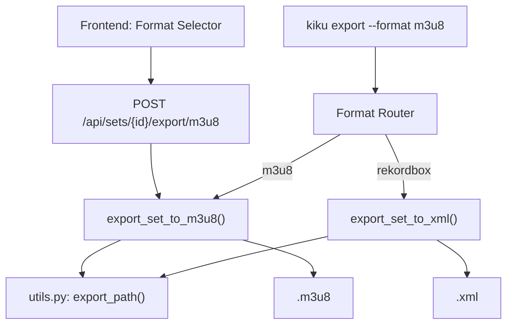

# Feature: M3U8 Export for Rekordbox

## Table of Contents

- [Executive Summary](#executive-summary)
  - [Next Steps](#next-steps)
- [Human Section](#human-section)
- [AI Section](#ai-section)
  - [Problem Statement](#problem-statement)
  - [Scope](#scope)
  - [Technical Design](#technical-design)
    - [M3U8 Format Details](#m3u8-format-details)
    - [Architecture Overview](#architecture-overview)
    - [File Changes](#file-changes)
  - [Implementation Plan](#implementation-plan)
    - [Phase 1: Core M3U8 Exporter](#phase-1-core-m3u8-exporter)
    - [Phase 2: CLI Integration](#phase-2-cli-integration)
    - [Phase 3: API and Frontend](#phase-3-api-and-frontend)
    - [Phase 4: Shared Utilities Refactor](#phase-4-shared-utilities-refactor)
  - [Metadata Strategy](#metadata-strategy)
  - [Testing Plan](#testing-plan)
  - [Migration and Backward Compatibility](#migration-and-backward-compatibility)
  - [Edge Cases](#edge-cases)
  - [Open Questions](#open-questions)

## Executive Summary

- **Problem**: Rekordbox XML import via pyrekordbox is fragile -- path encoding issues, version-sensitive schema, and heavy dependency for what Rekordbox ultimately treats as "playlist membership + track order." M3U8 achieves the same playlist import with a 15-line plain-text file and zero dependencies.
- **Solution**: New `export_set_to_m3u8()` function in `src/kiku/export/m3u8.py`, wired to CLI (`--format m3u8`, new default) and API (`POST /api/sets/{id}/export/m3u8`). Frontend gets a format selector dropdown replacing the "Export XML" button.
- **Metadata tradeoff**: M3U8 carries only duration, display title (Artist - Title), and file path. BPM, key, rating, cue points, genre, label, play count, and comments are NOT transferable. This is acceptable because Rekordbox ignores imported metadata anyway -- it uses its own analysis.
- **Path aliasing**: Reuses existing `_export_path()` logic (Linux `/run/media/mantis/` to macOS `/Volumes/`), extracted to shared `src/kiku/export/utils.py`.
- **Files changed**: 7 files (2 new, 5 modified). Zero new dependencies.
- **Test coverage**: Currently zero for export; this spec includes unit tests for both M3U8 and the shared path utility.

### Next Steps

- **Implement Phase 1 first**: Create `src/kiku/export/m3u8.py` and `src/kiku/export/utils.py` -- these are self-contained and testable in isolation.
- **Dependencies**: Research report at `tmp/mux/20260322-1300-m3u8-rekordbox-export/research/001-m3u8-rekordbox-format.md`, audit report at `tmp/mux/20260322-1300-m3u8-rekordbox-export/audit/001-current-exporter-analysis.md`
- **Decision needed from DJ**: Whether M3U8 should become the default format or remain opt-in behind `--format m3u8` (spec recommends: default to M3U8, keep XML available via `--format rekordbox`)
- **Routing hint**: Implementation agent should consume this spec; start with Phase 1 (pure Python, no integration points), then Phase 2 (CLI), then Phase 3 (API/frontend)

---

## Human Section

*(Reserved for human input -- do not modify.)*

---

## AI Section

### Problem Statement

Kiku currently exports sets as Rekordbox-compatible XML using the `pyrekordbox` library. This works, but creates friction in two ways:

**1. XML is overkill for what Rekordbox actually imports.**

When a DJ imports a playlist file into Rekordbox, the software uses its own analysis engine for all track metadata -- BPM, key, beat grids, waveforms, ratings. The 12 metadata fields Kiku painstakingly writes into XML (`AverageBpm`, `Tonality`, `Rating`, `Genre`, etc.) are read by Rekordbox but overwritten by its own values. Cue points in XML do transfer, but only when the XML schema matches Rekordbox's expected version exactly.

What Rekordbox actually needs from a playlist import:
- **File paths** (to locate tracks on disk)
- **Track order** (to build the playlist sequence)

That is exactly what M3U8 provides.

**2. The pyrekordbox dependency is a maintenance liability.**

The `pyrekordbox` library reverse-engineers Rekordbox's proprietary XML schema. Schema changes between Rekordbox versions can break imports silently -- tracks appear but with corrupted metadata, or the import completes with missing entries. M3U8 is a de facto standard with no version dependencies and no schema to break.

**Why M3U8 is the right format for set export:**

- Rekordbox imports M3U8 natively (File > Import > Import Playlist)
- Tracks are matched by absolute file path -- the same mechanism XML uses
- Track order is preserved by line order
- UTF-8 encoding handles international artist names and track titles
- The format is human-readable and trivially debuggable
- Zero external dependencies to generate
- Cross-compatible with Traktor (rename to `.m3u`), Serato (drag-drop), and VirtualDJ

The trade-off is honest: M3U8 does not carry cue points, beat grids, or rich metadata. But Rekordbox ignores those on import anyway. The DJ's cue points live in Rekordbox's own database, not in the import file. M3U8 is the right tool for the job because the job is "get this track order into Rekordbox," not "transfer my entire analysis."

### Scope

#### In Scope

1. New M3U8 export function (`export_set_to_m3u8()`)
2. Shared path utility extraction (`_export_path()` to `utils.py`)
3. CLI `--format` flag wiring (`m3u8` as new default, `rekordbox` preserved)
4. New API endpoint (`POST /api/sets/{id}/export/m3u8`)
5. Frontend format selector (dropdown replacing single "Export XML" button)
6. DJ metadata as M3U8 comments (optional, non-standard, for Kiku round-trip only)
7. Unit tests for M3U8 exporter and shared path utility
8. File existence validation with warnings

#### Out of Scope

1. M3U8 import (reading M3U8 files back into Kiku)
2. Rekordbox XML export removal (kept as `--format rekordbox`)
3. Cue point export via M3U8 (not possible in the format)
4. Windows path support (Kiku runs on Linux/macOS only)
5. Streaming/HLS M3U8 features (`#EXT-X-TARGETDURATION`, etc.)
6. Traktor `.nml` or Serato `.crate` export formats
7. Automatic Rekordbox collection management

### Technical Design

#### M3U8 Format Details

Every exported M3U8 file follows this exact structure:

```m3u8
#EXTM3U
#EXTINF:387,Moderat - A New Error
/Volumes/SSD/Musica/Moderat/A New Error.flac
#EXTINF:312,Bicep - Glue
/Volumes/SSD/Musica/Bicep/Glue.mp3
#EXTINF:445,Jon Hopkins - Open Eye Signal
/Volumes/SSD/Musica/Jon Hopkins/Open Eye Signal.flac
```

**Format rules:**

| Element | Rule |
|---------|------|
| Header | `#EXTM3U` on line 1, always |
| Track info | `#EXTINF:<duration>,<Artist> - <Title>` |
| Duration | Integer seconds; `-1` if unknown |
| Display title | `Artist - Title` format (space-dash-space separator) |
| File path | Absolute path, forward slashes only, platform-aliased |
| Encoding | UTF-8, no BOM |
| Line endings | `\n` (Unix) |
| Filename | `<set_name>.m3u8` (Rekordbox uses this as playlist name) |

**Optional DJ metadata comments** (ignored by all players, preserved for Kiku):

```m3u8
#EXTM3U
# Kiku Set: Deep Journey | Exported: 2026-03-22
#EXTINF:387,Moderat - A New Error
# kiku:bpm=120.50 key=8A energy=0.72 rating=4
/Volumes/SSD/Musica/Moderat/A New Error.flac
```

These `# kiku:` comment lines are strictly optional and controlled by a `--with-metadata` flag. They use a simple `key=value` format that Kiku could parse on re-import in the future. All players ignore lines starting with `#` that they do not recognize.

#### Architecture Overview



#### File Changes

| File | Action | Description |
|------|--------|-------------|
| `src/kiku/export/m3u8.py` | **Create** | Core M3U8 exporter function |
| `src/kiku/export/utils.py` | **Create** | Shared `export_path()` and `validate_paths()` |
| `src/kiku/export/rekordbox_xml.py` | **Modify** | Import `export_path` from `utils` instead of private `_export_path` |
| `src/kiku/cli.py` | **Modify** | Route `--format m3u8` to new exporter, change default |
| `src/kiku/api/routes/export.py` | **Modify** | Add `POST /api/sets/{id}/export/m3u8` endpoint |
| `frontend/src/lib/api/sets.ts` | **Modify** | Add `exportM3U8()` function |
| `frontend/src/lib/components/set/SetView.svelte` | **Modify** | Format selector dropdown |

### Implementation Plan

#### Phase 1: Core M3U8 Exporter

**File: `src/kiku/export/utils.py`**

Extract the shared path aliasing logic:

```python
"""Shared export utilities -- path aliasing and validation."""
from __future__ import annotations

from pathlib import Path

# Path aliases: (macOS prefix, Linux prefix).
_PATH_ALIASES: list[tuple[str, str]] = [
    ("/Volumes/", "/run/media/mantis/"),
]


def export_path(file_path: str, target_platform: str = "macos") -> str:
    """Convert Kiku's stored path to the target platform format.

    The database stores Linux-normalised paths (/run/media/mantis/...).
    For Rekordbox on macOS these become /Volumes/...
    """
    if target_platform == "macos":
        for mac_prefix, linux_prefix in _PATH_ALIASES:
            if file_path.startswith(linux_prefix):
                return mac_prefix + file_path[len(linux_prefix):]
    return file_path


def validate_track_paths(
    file_paths: list[str],
) -> tuple[list[str], list[str]]:
    """Check which track file paths exist on disk.

    Returns (found, missing) tuple of path lists.
    """
    found: list[str] = []
    missing: list[str] = []
    for fp in file_paths:
        if Path(fp).exists():
            found.append(fp)
        else:
            missing.append(fp)
    return found, missing
```

**File: `src/kiku/export/m3u8.py`**

```python
"""Export sets as M3U8 playlists for Rekordbox import.

M3U8 carries track order, duration, and display title -- exactly what
Rekordbox needs for playlist import. Tracks must already exist in
Rekordbox's collection at the file paths listed in the M3U8.
"""
from __future__ import annotations

from pathlib import Path

from kiku.config import DATA_DIR
from kiku.db.models import Set
from kiku.export.utils import export_path


def export_set_to_m3u8(
    set_: Set,
    output_path: str | None = None,
    *,
    target_platform: str = "macos",
    with_metadata: bool = False,
) -> str:
    """Export a Set as an M3U8 playlist file.

    Parameters
    ----------
    set_ : Set
        The set to export (with eager-loaded tracks via set_.tracks).
    output_path : str, optional
        Where to write the .m3u8 file. Default: data/<set_name>.m3u8.
    target_platform : str
        Target platform for path aliasing ("macos" or "linux").
    with_metadata : bool
        If True, include Kiku metadata as comment lines (BPM, key, energy, rating).
        These are ignored by all players but preserved for potential Kiku re-import.

    Returns
    -------
    str
        Path to the written M3U8 file.
    """
    tracks_in_set = sorted(set_.tracks, key=lambda st: st.position)
    set_name = set_.name or "set"

    lines: list[str] = ["#EXTM3U"]

    for st in tracks_in_set:
        track = st.track

        # Duration: integer seconds, -1 if unknown
        duration = int(track.duration_sec) if track.duration_sec else -1

        # Display title: Artist - Title
        artist = track.artist or "Unknown Artist"
        title = track.title or "Unknown Title"
        display = f"{artist} - {title}"

        lines.append(f"#EXTINF:{duration},{display}")

        # Optional Kiku metadata comment
        if with_metadata:
            meta_parts: list[str] = []
            if track.bpm:
                meta_parts.append(f"bpm={round(track.bpm, 2)}")
            if track.key:
                meta_parts.append(f"key={track.key}")
            if track.energy is not None:
                meta_parts.append(f"energy={track.energy}")
            if track.rating is not None and track.rating > 0:
                meta_parts.append(f"rating={track.rating}")
            genre = track.dir_genre or track.rb_genre
            if genre:
                meta_parts.append(f"genre={genre}")
            if meta_parts:
                lines.append(f"# kiku:{' '.join(meta_parts)}")

        # File path: absolute, forward slashes, platform-aliased
        file_path = track.file_path or ""
        file_path = export_path(file_path, target_platform)
        file_path = file_path.replace("\\", "/")
        lines.append(file_path)

    # Write file
    if output_path is None:
        output_path = str(DATA_DIR / f"{set_name}.m3u8")

    out = Path(output_path)
    out.parent.mkdir(parents=True, exist_ok=True)
    out.write_text("\n".join(lines) + "\n", encoding="utf-8")

    return str(out)
```

#### Phase 2: CLI Integration

**File: `src/kiku/cli.py`** (modify the `export` command, lines 495-532)

```python
@cli.command()
@click.argument("set_name")
@click.option("--format", "fmt", default="m3u8", help="Export format: m3u8 (default) or rekordbox")
@click.option("--output", "-o", default=None, help="Output file path")
@click.option("--with-cues", is_flag=True, help="Include transition cue points (rekordbox format only)")
@click.option("--with-metadata", is_flag=True, help="Include Kiku metadata as comments (m3u8 only)")
@click.option("--platform", default="macos", help="Target platform for path aliasing: macos or linux")
def export(set_name: str, fmt: str, output: str | None, with_cues: bool, with_metadata: bool, platform: str):
    """Export a set for import into Rekordbox or other DJ software."""
    from kiku.db.models import Set, TransitionCue, get_session

    session = get_session()
    set_ = session.query(Set).filter(Set.name.ilike(f"%{set_name}%")).first()

    if not set_:
        console.print(f"[yellow]Couldn't find a set matching '{set_name}' -- check the name and try again.[/]")
        return

    if fmt == "m3u8":
        from kiku.export.m3u8 import export_set_to_m3u8
        output_path = export_set_to_m3u8(
            set_, output, target_platform=platform, with_metadata=with_metadata,
        )
        track_count = len(set_.tracks)
        console.print(f"[green]Exported {track_count} tracks to {output_path}[/]")
        console.print("[dim]Import into Rekordbox: File > Import > Import Playlist[/]")

    elif fmt == "rekordbox":
        from kiku.export.rekordbox_xml import export_set_to_xml

        transition_cues = None
        if with_cues:
            cues = (
                session.query(TransitionCue)
                .filter(TransitionCue.set_id == set_.id)
                .order_by(TransitionCue.track_id, TransitionCue.start_sec)
                .all()
            )
            if cues:
                transition_cues: dict[int, list[dict]] = {}
                for c in cues:
                    transition_cues.setdefault(c.track_id, []).append({
                        "name": c.name, "type": c.cue_type,
                        "start": c.start_sec, "end": c.end_sec, "num": c.hot_cue_num,
                    })
                console.print(f"[cyan]Including {len(cues)} cue points from {len(transition_cues)} tracks[/]")
            else:
                console.print("[dim]No cue points found for this set.[/]")

        output_path = export_set_to_xml(set_, output, transition_cues=transition_cues)
        console.print(f"[green]Exported to {output_path}[/]")

    else:
        console.print(f"[red]Unknown format '{fmt}' -- choose 'm3u8' or 'rekordbox'.[/]")
```

#### Phase 3: API and Frontend

**File: `src/kiku/api/routes/export.py`** (add new endpoint)

```python
@router.post("/{set_id}/export/m3u8")
def export_m3u8(
    set_id: int,
    platform: str = "macos",
    with_metadata: bool = False,
    db: Session = Depends(get_db),
):
    s = db.get(Set, set_id)
    if not s:
        raise HTTPException(status_code=404, detail="Set not found")

    from kiku.export.m3u8 import export_set_to_m3u8

    output_path = export_set_to_m3u8(
        s, target_platform=platform, with_metadata=with_metadata,
    )
    return FileResponse(
        path=output_path,
        media_type="audio/x-mpegurl",
        filename=f"{s.name or 'set'}.m3u8",
    )
```

**File: `frontend/src/lib/api/sets.ts`** (add export function)

```typescript
export async function exportM3U8(setId: number): Promise<Blob> {
    const res = await fetch(`${API_BASE}/api/sets/${setId}/export/m3u8`, { method: 'POST' });
    if (!res.ok) {
        const text = await res.text().catch(() => 'Export failed');
        throw new Error(text);
    }
    return res.blob();
}
```

**File: `frontend/src/lib/components/set/SetView.svelte`** (format selector)

Replace the single "Export XML" button with a dropdown:

```svelte
<div class="export-group">
    <select bind:value={exportFormat} class="export-select">
        <option value="m3u8">M3U8 (Rekordbox)</option>
        <option value="rekordbox">Rekordbox XML</option>
    </select>
    <button class="export-btn" onclick={handleExport} disabled={exporting}>
        {exporting ? 'Exporting...' : 'Export'}
    </button>
    {#if exportMsg}
        <span class="export-msg">{exportMsg}</span>
    {/if}
</div>
```

The `handleExport` function routes to either `exportM3U8()` or `exportRekordbox()` based on the selected format, and sets the download filename extension accordingly (`.m3u8` or `.xml`).

#### Phase 4: Shared Utilities Refactor

Update `src/kiku/export/rekordbox_xml.py` to import from the shared utility:

```python
# Replace the private _export_path and _PATH_ALIASES with:
from kiku.export.utils import export_path

# Then replace all calls to _export_path() with export_path()
```

Remove the duplicated `_PATH_ALIASES` and `_export_path()` from `rekordbox_xml.py`.

### Metadata Strategy

#### What transfers via M3U8

| Data | M3U8 Representation | Rekordbox Behavior |
|------|---------------------|--------------------|
| Track order | Line order in file | Preserved as playlist order |
| Duration | `#EXTINF` duration field | Read but overridden by Rekordbox analysis |
| Artist + Title | `#EXTINF` display text | Shown during import, not written to metadata |
| File path | Absolute path line | Used to locate track on disk (primary matching) |

#### What is lost (and why that is acceptable)

| Data | Why the loss is acceptable |
|------|---------------------------|
| BPM | Rekordbox analyzes BPM itself; imported values are overwritten |
| Key/Tonality | Rekordbox analyzes key itself; imported values are overwritten |
| Rating | Rekordbox maintains its own ratings; XML-imported ratings are fragile |
| Cue points | Only transfer via XML when schema matches exactly; often corrupted |
| Genre | Rekordbox uses its own genre tags from file metadata |
| Album, Label | Not relevant for playlist import |
| Play count | Rekordbox maintains its own play counts |
| Comments | Not relevant for playlist import |

#### Optional Kiku metadata comments

When `--with-metadata` is enabled, the exporter writes Kiku-specific data as M3U8 comment lines:

```
# kiku:bpm=128.00 key=8A energy=0.85 rating=4 genre=Techno
```

**Purpose**: Future Kiku-to-Kiku round-trip. If Kiku ever supports M3U8 import, these comments provide the DJ's metadata without requiring re-analysis.

**Design decisions**:
- Prefix: `# kiku:` (space after `#` makes it a standard M3U comment; `kiku:` namespace avoids collisions)
- Format: `key=value` pairs, space-separated, single line per track
- No quotes around values (keeps parsing simple; spaces in genre names use the raw value since it is the final key=value pair)
- Placed between `#EXTINF` and the file path (players skip unrecognized `#` lines)

Custom `#EXT-X-` tags were considered and rejected. The `#EXT-X-` namespace is reserved for HLS streaming (RFC 8216), and using it for DJ metadata could cause issues with HLS-aware parsers. Plain comments are safer.

### Testing Plan

**File: `tests/test_m3u8_export.py`**

```python
"""Tests for M3U8 export."""
import pytest
from pathlib import Path
from unittest.mock import MagicMock

from kiku.export.m3u8 import export_set_to_m3u8
from kiku.export.utils import export_path, validate_track_paths


class TestExportPath:
    def test_linux_to_macos_alias(self):
        assert export_path("/run/media/mantis/SSD/track.mp3", "macos") == "/Volumes/SSD/track.mp3"

    def test_linux_to_macos_deep_path(self):
        assert export_path("/run/media/mantis/My Passport/Musica/artist/track.flac", "macos") == \
            "/Volumes/My Passport/Musica/artist/track.flac"

    def test_linux_keeps_non_aliased_path(self):
        assert export_path("/home/user/Music/track.mp3", "macos") == "/home/user/Music/track.mp3"

    def test_linux_platform_passthrough(self):
        assert export_path("/run/media/mantis/SSD/track.mp3", "linux") == "/run/media/mantis/SSD/track.mp3"


class TestValidateTrackPaths:
    def test_all_found(self, tmp_path):
        f1 = tmp_path / "a.mp3"
        f1.touch()
        found, missing = validate_track_paths([str(f1)])
        assert found == [str(f1)]
        assert missing == []

    def test_missing_file(self):
        found, missing = validate_track_paths(["/nonexistent/track.mp3"])
        assert found == []
        assert missing == ["/nonexistent/track.mp3"]


class TestExportSetToM3U8:
    def _make_mock_set(self, tracks_data: list[dict]) -> MagicMock:
        """Create a mock Set with mock SetTrack and Track objects."""
        set_ = MagicMock()
        set_.name = "Test Set"
        set_.tracks = []
        for i, td in enumerate(tracks_data):
            st = MagicMock()
            st.position = i
            st.track = MagicMock()
            st.track.artist = td.get("artist", "Artist")
            st.track.title = td.get("title", "Title")
            st.track.duration_sec = td.get("duration", 300)
            st.track.file_path = td.get("file_path", "/music/track.mp3")
            st.track.bpm = td.get("bpm")
            st.track.key = td.get("key")
            st.track.energy = td.get("energy")
            st.track.rating = td.get("rating")
            st.track.dir_genre = td.get("genre")
            st.track.rb_genre = None
            set_.tracks.append(st)
        return set_

    def test_basic_export(self, tmp_path):
        set_ = self._make_mock_set([
            {"artist": "Bicep", "title": "Glue", "duration": 312,
             "file_path": "/run/media/mantis/SSD/Bicep/Glue.mp3"},
        ])
        out = tmp_path / "test.m3u8"
        result = export_set_to_m3u8(set_, str(out))
        content = out.read_text(encoding="utf-8")
        assert content.startswith("#EXTM3U\n")
        assert "#EXTINF:312,Bicep - Glue\n" in content
        assert "/Volumes/SSD/Bicep/Glue.mp3\n" in content

    def test_unknown_duration(self, tmp_path):
        set_ = self._make_mock_set([
            {"artist": "X", "title": "Y", "duration": None,
             "file_path": "/music/track.mp3"},
        ])
        out = tmp_path / "test.m3u8"
        export_set_to_m3u8(set_, str(out), target_platform="linux")
        content = out.read_text(encoding="utf-8")
        assert "#EXTINF:-1," in content

    def test_track_order_preserved(self, tmp_path):
        set_ = self._make_mock_set([
            {"artist": "First", "title": "A", "duration": 100, "file_path": "/a.mp3"},
            {"artist": "Second", "title": "B", "duration": 200, "file_path": "/b.mp3"},
            {"artist": "Third", "title": "C", "duration": 300, "file_path": "/c.mp3"},
        ])
        out = tmp_path / "test.m3u8"
        export_set_to_m3u8(set_, str(out), target_platform="linux")
        content = out.read_text(encoding="utf-8")
        lines = content.strip().split("\n")
        path_lines = [l for l in lines if not l.startswith("#")]
        assert path_lines == ["/a.mp3", "/b.mp3", "/c.mp3"]

    def test_with_metadata(self, tmp_path):
        set_ = self._make_mock_set([
            {"artist": "Test", "title": "Track", "duration": 300,
             "file_path": "/music/track.mp3", "bpm": 128.0, "key": "8A",
             "energy": 0.85, "rating": 4, "genre": "Techno"},
        ])
        out = tmp_path / "test.m3u8"
        export_set_to_m3u8(set_, str(out), target_platform="linux", with_metadata=True)
        content = out.read_text(encoding="utf-8")
        assert "# kiku:bpm=128.0 key=8A energy=0.85 rating=4 genre=Techno" in content

    def test_utf8_encoding(self, tmp_path):
        set_ = self._make_mock_set([
            {"artist": "Ryuichi Sakamoto", "title": "Merry Christmas Mr. Lawrence",
             "duration": 290, "file_path": "/music/坂本龍一/track.flac"},
        ])
        out = tmp_path / "test.m3u8"
        export_set_to_m3u8(set_, str(out), target_platform="linux")
        content = out.read_text(encoding="utf-8")
        assert "坂本龍一" in content

    def test_default_output_path(self):
        set_ = self._make_mock_set([
            {"artist": "A", "title": "B", "duration": 100, "file_path": "/x.mp3"},
        ])
        result = export_set_to_m3u8(set_, target_platform="linux")
        assert result.endswith("Test Set.m3u8")
        # Clean up
        Path(result).unlink(missing_ok=True)

    def test_empty_set(self, tmp_path):
        set_ = self._make_mock_set([])
        out = tmp_path / "empty.m3u8"
        export_set_to_m3u8(set_, str(out))
        content = out.read_text(encoding="utf-8")
        assert content.strip() == "#EXTM3U"

    def test_missing_artist_title(self, tmp_path):
        set_ = self._make_mock_set([
            {"artist": None, "title": None, "duration": 100,
             "file_path": "/music/track.mp3"},
        ])
        out = tmp_path / "test.m3u8"
        export_set_to_m3u8(set_, str(out), target_platform="linux")
        content = out.read_text(encoding="utf-8")
        assert "Unknown Artist - Unknown Title" in content
```

### Migration and Backward Compatibility

**Approach: M3U8 as new default, XML preserved as option.**

| Change | Impact |
|--------|--------|
| `--format` default changes from `rekordbox` to `m3u8` | DJs who run `kiku export <set>` without `--format` will get M3U8 instead of XML |
| XML export remains available via `--format rekordbox` | No functionality removed |
| API adds new endpoint, keeps existing endpoint | No breaking API changes |
| Frontend defaults to M3U8 in dropdown, XML still selectable | No functionality removed |

**Rationale for changing the default**: M3U8 is simpler, faster, and achieves the same result in Rekordbox. DJs who need cue point export (the one advantage of XML) can use `--format rekordbox` explicitly. The common case should be the easiest case.

**No deprecation of XML export.** The XML exporter stays for DJs who have workflows that depend on it, or for future enhancements where XML schema compatibility improves. The two formats serve different purposes: M3U8 for "get this set into Rekordbox," XML for "transfer rich metadata."

### Edge Cases

| Scenario | Behavior |
|----------|----------|
| **Track with no file path** | Write empty string as path; Rekordbox will skip it silently |
| **Track with no duration** | Use `-1` in `#EXTINF` (standard for unknown duration) |
| **Track with no artist or title** | Use `Unknown Artist` / `Unknown Title` |
| **File on external drive not mounted** | Path is written as-is (aliased to `/Volumes/...`); Rekordbox skips if drive is disconnected. No error in the M3U8. |
| **Duplicate tracks in set** | Written as separate entries; Rekordbox may include duplicates |
| **Very long set (100+ tracks)** | No format limitation; Rekordbox handles large playlists |
| **Special characters in path** | UTF-8 encoding handles all characters; no URL-encoding needed |
| **Set name with special characters** | Sanitize for filename: replace `/`, `\`, `:` with `_` in the output filename |
| **Cross-platform: Linux paths to macOS** | `export_path()` converts `/run/media/mantis/` to `/Volumes/`; other Linux paths pass through unchanged |
| **Commas in track title** | Safe -- M3U8 spec separates duration from title by the first comma only |
| **Empty set (no tracks)** | Write valid M3U8 with only `#EXTM3U` header; Rekordbox imports empty playlist |

### Open Questions

1. **Default format**: Should `m3u8` be the default for `--format`, or should it remain `rekordbox` until DJs have tested the M3U8 workflow? (Spec recommends: default to M3U8.)

2. **Platform detection**: Should Kiku auto-detect the target platform instead of requiring `--platform macos`? The export runs on Linux but targets macOS -- auto-detection would not help here. The `macos` default seems correct since that is where Rekordbox runs.

3. **File existence warnings**: Should the exporter warn when track file paths do not exist on disk? The paths are Linux paths that get aliased to macOS, so checking existence on the Linux side is misleading. Consider: validate existence of the original (pre-alias) paths to catch tracks that have been deleted from the library.

4. **Traktor `.m3u` option**: Should Kiku offer `--format m3u` (identical content, `.m3u` extension) for Traktor users? Trivial to implement but adds surface area.

5. **`with_metadata` default**: Should metadata comments be included by default, or opt-in? (Spec recommends: opt-in via `--with-metadata` to keep the default output clean and maximally compatible.)
