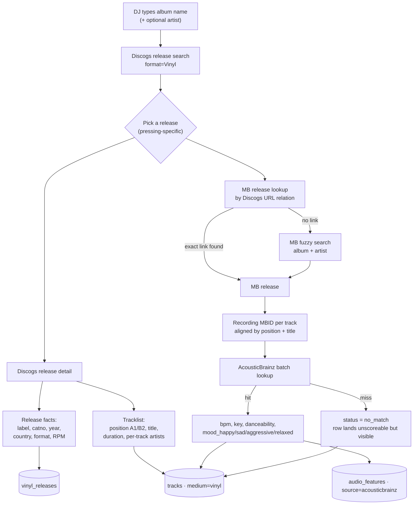
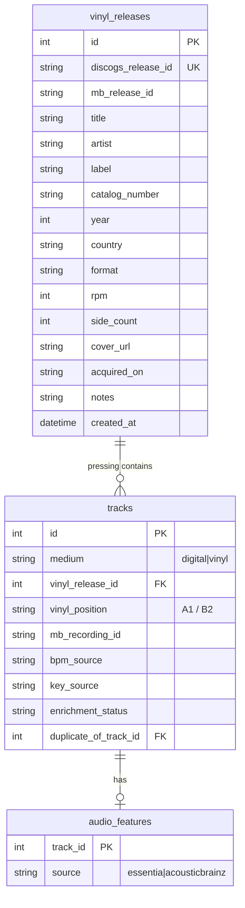

# Vinyl library — data acquisition & storage design

Supporting design for spec `030-vinyl-library-hybrid-sets.md`. Scope is deliberately
narrow: **where each field comes from, and where it lives.** No planner changes, no UI,
no export handling — those follow once the rows are trustworthy.

---

## 1. The organizing principle: provenance over completeness

The failure mode this design exists to prevent is a vinyl track that *looks* as
well-known as a digital one but isn't. A hand-typed BPM, an AcousticBrainz BPM, and an
Essentia-analyzed BPM are three different claims with three different error bars, and
Kiku's whole value proposition is that it explains *why* — which it cannot do honestly
on top of laundered data.

So every acquired field carries a source, and **enrichment never overwrites a stronger
source**. The precedence ladder, strongest first:

| Rank | Source | Applies to |
|---|---|---|
| 1 | `manual` | anything the DJ typed — never overwritten by any automatic pass |
| 2 | `essentia` | a rip that went through `kiku analyze` — real audio, full feature set |
| 3 | `rekordbox` | existing digital rows, unchanged |
| 4 | `acousticbrainz` | vinyl enrichment — same model family, different corpus |
| 5 | `discogs` / `musicbrainz` | catalog facts only (title, duration, label, year, position) |

There is precedent for this in the schema already: `Track.rating_source` and
`Track.energy_source` do exactly this job for their fields.

---

## 2. Acquisition pipeline



### Stage 1 — Release identity (Discogs)

Anchor on the **release**, not the master. A master is the abstract album; a release is
the specific pressing, and pressings differ in exactly the ways that matter here — a
2×LP has different side positions than the 1×LP, and reissues re-sequence. The DJ owns a
pressing, so the pressing is the identity.

`DiscogsSource` already does search, URL fetch, release detail, artist joining, and
duration parsing (`src/kiku/metadata/sources/discogs.py`). Three things it currently
throws away that this feature needs:

- **`position`** — the `"A1"` string is discarded; `_to_candidate` replaces it with a
  running integer counter (`discogs.py:94-108`). This is the single most vinyl-specific
  field in the whole API and it is on the floor.
- **per-track `artists` / `extraartists`** — compilations and remix credits.
- **release `formats`** — `12"`, `LP`, `45 RPM`, which is where RPM comes from.

Add `format=Vinyl` to the search params so the candidate list is pressings the DJ could
actually own, not digital-only releases.

### Stage 2 — MBID resolution (the fragile hop)

AcousticBrainz is keyed by MusicBrainz **recording** MBID. Discogs carries no MBID, so
this hop has to be crossed, and it is where a wrong answer does real damage: a
mis-resolved MBID silently attaches a different record's BPM and mood, which is worse
than a blank.

Two paths, preferred first:

1. **Exact, via URL relation.** MusicBrainz stores Discogs release URLs as relationships.
   `GET /ws/2/url?resource=https://www.discogs.com/release/<id>&inc=release-rels&fmt=json`
   returns the linked MB release directly. When the link exists this is not a match at
   all — it is a lookup, and hop-2 fuzziness disappears. Electronic vinyl is
   well cross-linked, so this should carry most of the traffic. *Verify the exact
   endpoint shape during the spike.*
2. **Fuzzy fallback.** MB release search by album + artist (`MusicBrainzClient.search_releases`
   already exists and is rate-limit throttled), then align tracklists by position, title,
   and duration. `src/kiku/metadata/correct.py` already has the title-alignment matcher —
   reuse it rather than writing a second one.

Either way the recording MBID is already sitting in the MB response at
`media[].tracks[].recording.id` and gets **discarded** by
`MusicBrainzSource._to_candidate` (`src/kiku/metadata/sources/musicbrainz.py:44-70`).
Adding `mbid` to `RecordingCandidate` and populating it is a two-line change.

Every resolution records how it was reached and its confidence. A fuzzy match below
threshold does not silently proceed — it surfaces for confirmation.

### Stage 3 — Feature enrichment (AcousticBrainz)

Two endpoints per recording MBID:

- **low-level** → `rhythm.bpm`, `tonal.key_key` + `tonal.key_scale` (→ Camelot through the
  existing `toCamelot`)
- **high-level** → `highlevel.danceability.all.danceable`,
  `highlevel.mood_happy/mood_sad/mood_aggressive/mood_relaxed`

Those four mood models are the *same* `mood_*-msd-musicnn` family already sitting in
`models/` and already producing `AudioFeatures.mood_*`. That is the reason this source was
chosen over a BPM-only web lookup: the numbers land on the same scale, so a vinyl track and
a digital track are comparable rather than merely co-located.

There is a batch endpoint (`?recording_ids=<mbid>;<mbid>;…`, ~25 per call) — use it; a
12-track LP should cost two requests, not twenty-four. *Confirm the limit in the spike.*

`vibe_brightness` / `vibe_density` derive from these through the existing `kiku.vibe`
path, so vinyl scores on the same axes as everything else.

**What AcousticBrainz cannot give**: waveform envelopes, band splits, beat positions,
MFCCs, per-section energy. Those stay NULL. This is an already-supported state —
`get_partially_analyzed_tracks()` exists (`store.py:221`) — but it does mean the waveform
view, cue points, and the transition inspector have nothing to draw for vinyl. The rip →
`kiku analyze` escape hatch remains the only route to those.

### Stage 4 — Misses land visibly

A record whose tracks aren't in AcousticBrainz still enters the library. It gets
`enrichment_status = 'no_match'` and no BPM, which means it shows up in Taste DNA and in
`kiku gaps` (both genuinely useful without a BPM) and stays out of the beam-search pool
(`planner.py:92` filters on BPM) until the DJ fills it in. Nothing is guessed. Nothing is
hidden.

---

## 3. Storage



### Why one `tracks` table, not a parallel vinyl entity

`SetTrack`, `TransitionCue`, `TrackAffinity`, the tinder queue, and every scoring path key
off `Track.id`. A separate vinyl table forks all of them. A `medium` column forks none —
and it is what makes the finding from spec 030 pay off: because the candidate pool is only
`Track.bpm IS NOT NULL AND > 0`, a vinyl row with a BPM is *already* plannable the moment
it lands.

### Why a `vinyl_releases` table, given album grouping is derived

Kiku has no albums table — `album_key()` hashes normalized album + artist and groups on
the fly (`src/kiku/metadata/album_key.py`). That works fine for browsing, but it cannot
hold catalog number, RPM, country, or acquisition date, because those are facts about a
**physical object you own once**, not about a track. Repeating them across eight track
rows means eight places to drift.

The unique constraint on `discogs_release_id` also gives re-import safety for free: adding
the same record twice returns "you already have this" instead of duplicating a side.

### New columns on `tracks`

| Column | Type | Purpose |
|---|---|---|
| `medium` | TEXT NOT NULL DEFAULT `'digital'` | `digital` \| `vinyl`. Backfilled for every existing row. |
| `vinyl_release_id` | INT FK → `vinyl_releases.id` | NULL for digital. |
| `vinyl_position` | TEXT | Raw Discogs string — `A1`, `B2`, `Digi 1`. Display truth. |
| `mb_recording_id` | TEXT | The AcousticBrainz key. Useful for digital rows later too. |
| `bpm_source` | TEXT | `rekordbox` \| `acousticbrainz` \| `essentia` \| `manual` |
| `key_source` | TEXT | same ladder |
| `enrichment_status` | TEXT | `pending` \| `enriched` \| `no_match` \| `manual` |
| `duplicate_of_track_id` | INT FK → `tracks.id` | Same work, other format — see §4. |

Plus one column on `audio_features`: **`source`** (`essentia` \| `acousticbrainz`). The
table has `analyzed_at` but no record of *what* analyzed it. That gap needs closing
regardless of this feature; here it is load-bearing, because it is the only thing that
lets you later audit whether the two pipelines really are on the same scale.

### Reusing `disc_number` / `track_number` for sides

`vinyl_position` holds the display string; sorting comes from parsing it into the columns
that already exist: **`disc_number` = side ordinal** (A=1, B=2, C=3, D=4) and
**`track_number` = index within the side**. Album views and album-order queries then sort
vinyl correctly with no new code.

The honest caveat: for a 2×LP this makes `disc_number` mean *side*, not *disc*. That is a
deliberate trade — the side is the unit of DJ action (you flip a side; you don't flip a
disc) — but it should be a decision made on purpose, not discovered later. The alternative
is a dedicated `side_ordinal` column and leaving `disc_number` physically accurate.

`_backfill_filename_track_numbers` only touches rows that have a `file_path`
(`sync.py:246`), so it cannot reach vinyl rows and scramble this.

### Migration

One additive Alembic migration: create `vinyl_releases`, add the columns above, backfill
`medium = 'digital'` everywhere, add `audio_features.source = 'essentia'` for existing
rows. Alembic is the sole schema authority (`models.py:_init_schema` deliberately refuses
`create_all`). Unique constraints: `vinyl_releases.discogs_release_id`, and
`(vinyl_release_id, vinyl_position)` on tracks so re-import updates rather than duplicates.

---

## 4. The one design question this raises: owning a record twice

If a track exists both as a digital file and on the shelf, that is two rows in `tracks`,
both BPM-bearing, both in the candidate pool. Left alone, beam search can put the same
music in a set twice, or recommend the vinyl copy when the CDJ file is right there.

This is not an edge case — for a DJ who buys records they already play digitally, it is
the normal case. And it changes what a hybrid set *is*: when you own both, the format is a
**preference the planner can optimise**, not a constraint it must respect. That is a
better feature than the one spec 030 describes, and it only exists if the duplicate link
is captured at import time.

Proposal: fuzzy-match each incoming vinyl track against the existing library during
import, and record `duplicate_of_track_id` on the vinyl row when it lands above threshold.
Collapse to one row per work at planning time. The import UI shows the matches it found so
the DJ can break a wrong link.

---

## 5. Module layout

```
src/kiku/acousticbrainz/client.py   # sibling to musicbrainz/ — not vinyl-specific
src/kiku/vinyl/identity.py          # Discogs release → MB release → recording MBIDs
src/kiku/vinyl/importer.py          # search → candidates → preview diff → apply
src/kiku/vinyl/enrich.py            # AcousticBrainz → Track fields + AudioFeatures
src/kiku/vinyl/position.py          # "A1" → (side ordinal, index); "Digi 1" → (None, n)
```

The AcousticBrainz enricher is **not** a `MetadataSource` and must not join that registry
— sources identify *releases* from text or a URL, this enriches *recordings* from an MBID.
Different contract, different lifecycle.

The importer should borrow the shape of `kiku fix-album` (`metadata/correct.py`):
preview the diff, `--dry-run` / `--yes`, apply. That flow is already proven against a real
Bandcamp release and the DJ already knows it.

---

## 6. Build order

1. **AcousticBrainz coverage spike** — 20-30 real records off the shelf, resolved to
   recording MBIDs, measuring hit rate for BPM, key, and mood *separately*. Nothing else
   is worth building until this number exists: it decides whether the import UI is
   "confirm what we found" or "fill in what we couldn't".
2. Migration + `vinyl_releases` + columns.
3. `RecordingCandidate.mbid`, Discogs `position`/`formats` retention, `vinyl/position.py`.
4. Identity resolution with confidence + manual override.
5. Enrichment with the precedence ladder.
6. `kiku vinyl add` / `kiku vinyl enrich` with dry-run preview.
7. Regression test pinning that `kiku sync` leaves vinyl rows untouched.
